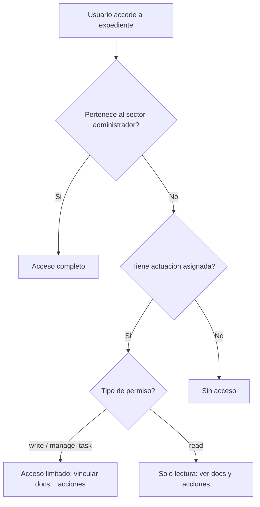

# Reglas de Acceso y Permisos

## Condiciones para Gestionar un Expediente

Un usuario puede gestionar un expediente bajo las siguientes condiciones:

### 1. Si pertenece al sector administrador del expediente

El sector administrador es la reparticion#sector que tiene la propiedad principal del expediente. Los usuarios que pertenecen a este sector tienen permisos completos para gestionar el expediente, incluyendo la vinculacion de documentos, la asignacion de tareas, la transferencia de propiedad y el Asistente AI.

**Logica de Acceso**: El sistema verifica si el `user_id` del usuario autenticado pertenece a un `sector_id` que coincide con el `admin_sector_id` del expediente.

### 2. Si su sector tiene una actuacion asignada dentro del expediente

Cuando el sector de un usuario ha recibido una Task o Actuacion especifica dentro de un expediente, los usuarios de ese sector obtienen permisos temporales o especificos para gestionar aspectos relacionados con esa actuacion. Esto no implica una gestion completa del expediente, sino la capacidad de realizar las acciones necesarias para completar la tarea asignada (ej., crear y vincular un documento solicitado al expediente).

Si tiene solo visualizar, solo puede ver la solapa "Documentos y Acciones" pero no puede operar el chat ni crear acciones, ni agregar documentos.

**Logica de Acceso**: El sistema verifica si existe una Task activa donde el `recipient_sector_id` coincide con el `sector_id` del usuario autenticado y si el `user_id` tiene los permisos de `write` o `manage_task` sobre esa actuacion especifica. Estos permisos se propagan al expediente para las acciones relacionadas con la actuacion.

---

## Matriz de Permisos por Rol

| Accion | Sector Administrador | Sector Actuante (write) | Sector Actuante (read) |
|--------|:--------------------:|:-----------------------:|:----------------------:|
| Ver documentos | Si | Si | Si |
| Ver historial de acciones | Si | Si | Si |
| Vincular documentos | Si | Si | No |
| Crear solicitud de actuacion | Si | Si | No |
| Transferir expediente | Si | No | No |
| Asignar responsable | Si | No | No |
| Subsanar documento | Si | Si | No |
| Usar Asistente AI | Si | No | No |
| Descargar expediente | Si | Si | Si |
| Marcar como favorito | Si | Si | Si |

---

## Reparticion Administradora

La Reparticion#Sector Administradora es la unidad organizacional que tiene la propiedad formal del expediente. Por defecto, se asigna segun la configuracion del tipo de expediente en el BackOffice (puede ser la reparticion del usuario creador o una reparticion especifica).

Sus capacidades incluyen:

- **Gestionar el expediente**: Realizar todas las operaciones inherentes al ciclo de vida del expediente, como añadir documentos, cargar informacion y seguir su tramitacion

- **Crear solicitudes**: Generar nuevas solicitudes de actuacion dentro del expediente, impulsando su avance y las interacciones con otras reparticiones

- **Transferir el expediente**: Mover el expediente a otra reparticion#sector para su continuidad o resolucion. Al ejecutarse la transferencia, la Reparticion Administradora original pierde ese rol, y la reparticion#sector receptor pasa a ser la nueva administradora

!!! info "Asignacion de la Reparticion Administradora"
    La reparticion administradora se define al crear el expediente, basandose en la configuracion del tipo de expediente en el BackOffice. Puede ser la reparticion del usuario creador (tipo "creator") o una reparticion especifica fija (tipo "specific").

---

## Reparticiones Actuantes

Las Reparticiones Actuantes son aquellas reparticion#sector que son autorizados para intervenir en la tramitacion del expediente en momentos especificos. Su participacion se activa cuando se les solicita una intervencion a traves de la seccion de Acciones.

Sus funciones principales incluyen:

- **Vincular documentos**: Realizar la tarea solicitada y vincular el documento con la informacion que les ha sido solicitada dentro del marco del expediente

- **Solicitar actuaciones**: Trabajar en conjunto con la Reparticion Administradora y otras reparticiones para asegurar el correcto avance del expediente, como por ejemplo solicitar una actuacion a otro sector especifico

- **Registro de actuaciones**: Dejar constancia de sus intervenciones y acciones dentro del expediente, garantizando la trazabilidad y transparencia del proceso

---

## Flujo de Validacion de Permisos

---

## Cambio de Permisos por Transferencia

Cuando se ejecuta una transferencia de expediente, los permisos se modifican de la siguiente manera:

| Momento | Sector Emisor | Sector Receptor |
|---------|:-------------:|:---------------:|
| **Antes de transferir** | Administrador (acceso completo) | Sin acceso |
| **Despues de transferir** | Sin acceso | Administrador (acceso completo) |

!!! warning "Perdida de permisos"
    El sector emisor pierde todos los permisos de gestion sobre el expediente al completarse la transferencia. Solo podra volver a acceder si recibe una solicitud de actuacion o si el expediente le es transferido nuevamente.

---

## Permisos y Multi-Tenancy

El sistema opera bajo un esquema multi-tenant donde cada organizacion (municipio) tiene su propio schema en la base de datos. Los permisos de expedientes operan exclusivamente dentro del schema de la organizacion correspondiente, garantizando aislamiento total entre tenants.
