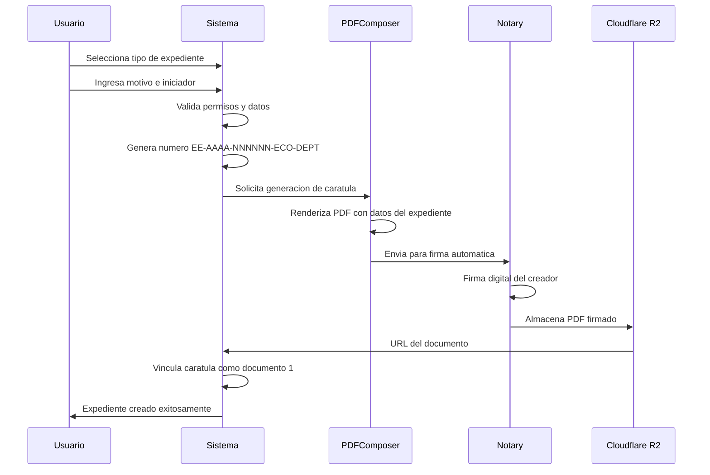
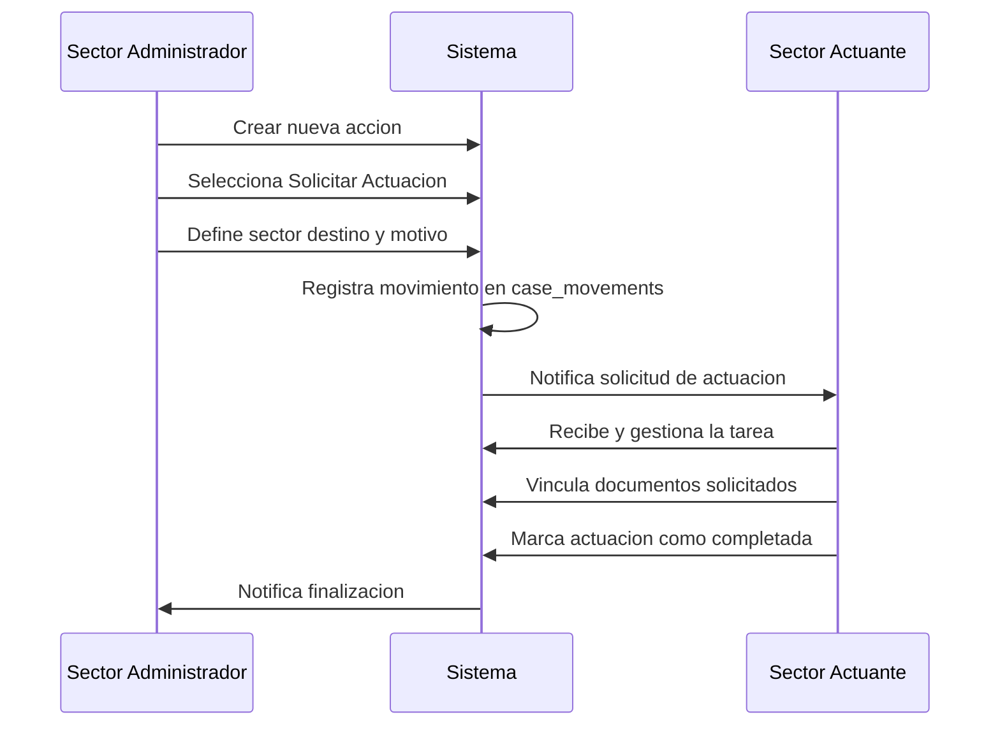
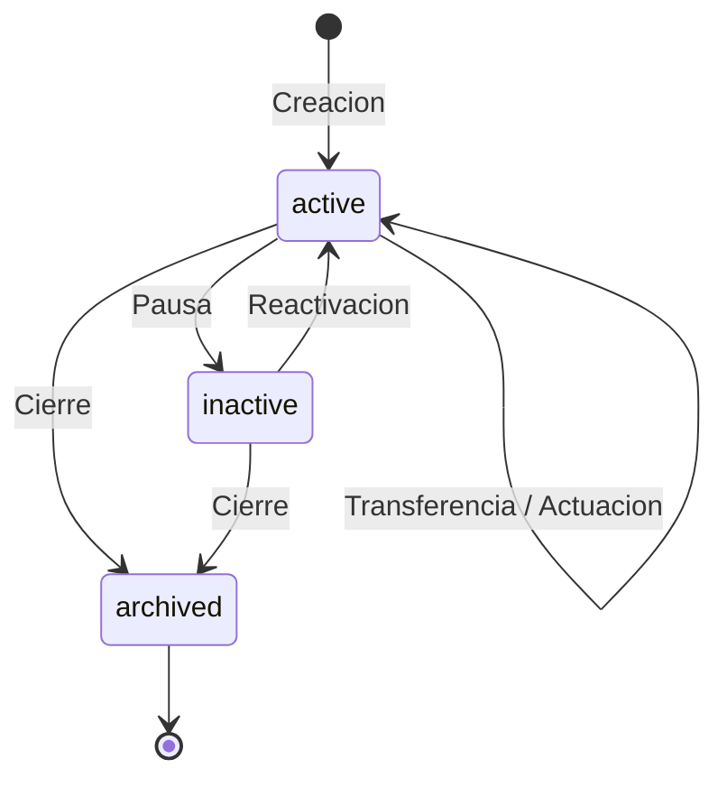

# Casos de Uso - Modulo Expedientes

## Que es el Modulo Expedientes?

El modulo de Expedientes es el **contenedor digital central de GDI** que organiza y gestiona el ciclo de vida completo de los tramites administrativos. Facilita la colaboracion entre areas y promueve una interaccion mas eficiente con los ciudadanos.

Un **Expediente electronico** (EE) es un conjunto de documentos digitales vinculados entre si que documentan un procedimiento administrativo especifico, desde su inicio hasta su resolucion, asegurando trazabilidad, transparencia y eficiencia.

GDI va mas alla del expediente tradicional, rompiendo con la logica lineal de tramitacion, habilitando flujos simultaneos, colaborativos y dinamicos entre multiples sectores.

---

## Propuesta de Valor

### Caracteristicas Diferenciadoras

- **Flujos no lineales**: Multiples sectores pueden actuar simultaneamente sobre un expediente, eliminando cuellos de botella secuenciales
- **Caratula automatica con firma digital**: Al crear un expediente se genera un PDF caratula firmado automaticamente, sin intervencion manual
- **Trazabilidad completa**: Cada accion queda registrada con timestamp, usuario y sector en el historial de movimientos
- **Asistente AI integrado**: Consultas conversacionales por expediente para resumenes, tareas pendientes y estado actual
- **Transferencias formales**: Cambio de propiedad entre sectores con generacion automatica de Pase de Vista (PV)
- **Colaboracion inter-areas**: Solicitudes de actuacion que permiten trabajo coordinado sin transferir propiedad

---

## Casos de Uso Principales

| **Funcionalidad** | **Descripcion** | **Actor Principal** |
|-------------------|------------------|---------------------|
| **Creacion de Expedientes** | Iniciacion de nuevos expedientes con tipo, motivo e iniciador. Genera numero unico y caratula automatica | Usuario habilitado |
| **Generacion de Caratula** | Creacion automatica de un documento PDF (CAEX) con datos del expediente, firmado digitalmente | Sistema (automatico) |
| **Vinculacion de Documentos** | Asociacion de documentos oficiales existentes al expediente, manteniendo orden cronologico | Usuario del sector administrador o actuante |
| **Solicitud de Actuacion** | Requerimiento formal a otro sector para que intervenga en el expediente | Usuario del sector administrador |
| **Transferencia de Propiedad** | Cambio formal del sector administrador del expediente con generacion de PV | Usuario del sector administrador |
| **Asignacion de Responsable** | Designacion informal de un usuario como responsable de seguimiento dentro del sector | Usuario del sector administrador |
| **Subsanacion de Documentos** | Reemplazo de un documento vinculado con justificacion, manteniendo historial | Usuario autorizado |
| **Consulta con Asistente AI** | Interaccion conversacional para resumenes, estado y tareas pendientes del expediente | Cualquier usuario con acceso |
| **Seguimiento de Historial** | Visualizacion cronologica de todos los movimientos y acciones del expediente | Cualquier usuario con acceso |

---

## Caso de Uso 1: Creacion de Expediente

### Descripcion

Un usuario inicia un nuevo expediente seleccionando el tipo, ingresando el motivo y definiendo el tipo de iniciador (interno o externo). El sistema genera automaticamente el numero oficial, la caratula PDF y la firma digital.

### Flujo Principal

### Precondiciones

- El usuario pertenece a una reparticion habilitada para crear el tipo de expediente seleccionado
- El tipo de expediente esta activo en la configuracion del BackOffice

### Postcondiciones

- Se crea el registro del expediente con numero unico
- Se genera la caratula CAEX como documento oficial firmado
- La caratula queda vinculada como primer documento (order_number=1)
- El expediente queda asignado al sector administrador segun configuracion

### Datos Requeridos

| Campo | Tipo | Obligatorio | Descripcion |
|-------|------|:-----------:|-------------|
| Tipo de expediente | Dropdown | Si | Seleccion del catalogo configurado en BackOffice |
| Motivo | Textarea (200 chars) | Si | Justificacion de la creacion del expediente |
| Tipo de inicio | Tab selector | Si | Interno (Municipalidad) o Externo (Vecino) |
| CUIT/CUIL | Text input | Condicional | Solo si el tipo de inicio es Externo |
| Nombre/Razon Social | Auto-complete | Condicional | Se autocompleta via API al ingresar CUIT/CUIL |

---

## Caso de Uso 2: Vinculacion de Documentos

### Descripcion

Un usuario asocia documentos oficiales ya existentes en GDI al expediente. Los documentos mantienen su integridad original y se visualizan en orden cronologico de vinculacion.

### Flujo Principal

1. El usuario accede a la seccion "Documentos" del expediente
2. Selecciona "Vincular nuevo documento"
3. Busca el documento por numero oficial, tipo o contenido
4. Previsualiza el documento seleccionado
5. Confirma la vinculacion
6. El documento aparece en la lista con su orden secuencial

### Reglas de Negocio

- Solo se pueden vincular documentos en estado `signed` (firmados)
- Un mismo documento puede estar vinculado a multiples expedientes
- El orden se asigna secuencialmente segun el momento de vinculacion
- La vinculacion se registra en `case_official_documents` con el `order_number` correspondiente
- Solo usuarios del sector administrador o actuante pueden vincular documentos

---

## Caso de Uso 3: Solicitud de Actuacion

### Descripcion

Un usuario del sector administrador solicita formalmente a otro sector que intervenga en el expediente. Esto genera una tarea que el sector destinatario debe atender.

### Flujo Principal

### Campos de la Solicitud

| Campo | Tipo | Obligatorio | Descripcion |
|-------|------|:-----------:|-------------|
| Reparticion#Sector destino | Busqueda | Si | Sector al que se dirige la solicitud |
| Responsable | Busqueda | No | Usuario especifico dentro del sector |
| Motivo | Textarea (254 chars) | Si | Descripcion del proposito de la solicitud |
| Asentar en Expediente | Toggle | No | Registra formalmente la accion como documento |

### Reglas de Negocio

- Solo el sector administrador puede crear solicitudes de actuacion
- El sector actuante obtiene permisos temporales para gestionar la tarea
- Si se asienta en el expediente, se genera un documento formal (Pase en Paralelo, Providencia Interna, etc.)
- Toda solicitud de actuacion requiere un cierre formal

---

## Caso de Uso 4: Transferencia de Expediente

### Descripcion

El sector administrador transfiere la propiedad del expediente a otro sector. Esto implica un cambio formal de responsabilidad donde el sector emisor pierde permisos y el receptor se convierte en administrador.

### Flujo Principal

1. El usuario accede a "Nueva accion" desde la seccion Acciones
2. Selecciona transferir el expediente
3. Define el sector destino y el motivo
4. El sistema genera automaticamente un Pase de Vista (PV)
5. El PV se firma automaticamente y se vincula al expediente
6. La propiedad cambia al sector receptor
7. El sector emisor pierde permisos de administracion
8. Se registra el movimiento de tipo `transfer` en `case_movements`

### Reglas de Negocio

- Solo el sector administrador actual puede transferir
- Se genera automaticamente un documento PV (Pase de Vista) firmado
- El PV se vincula al expediente como parte del historial
- El sector emisor pierde todos los permisos de gestion
- El sector receptor se convierte en el nuevo administrador

!!! warning "Accion Irreversible"
    La transferencia cambia formalmente la propiedad del expediente. El sector emisor no podra gestionar el expediente despues de la transferencia, salvo que reciba una nueva solicitud de actuacion o se le transfiera nuevamente.

---

## Caso de Uso 5: Asignacion de Responsable

### Descripcion

Dentro del sector administrador, se designa un usuario como responsable del seguimiento y gestion del expediente. Es una asignacion informal que no modifica permisos formales.

### Flujo Principal

1. El usuario accede a la opcion "Asignar" desde la vista del expediente
2. Busca y selecciona al usuario responsable por nombre o rol
3. Confirma la asignacion
4. El expediente aparece en la pestaña "Mis Expedientes" del usuario asignado

### Reglas de Negocio

- La asignacion es un dato informativo, no modifica permisos formales
- Solo se pueden asignar usuarios que pertenezcan al sector administrador
- Un expediente puede tener un unico usuario asignado a la vez

---

## Caso de Uso 6: Subsanacion de Documentos

### Descripcion

Un usuario reemplaza un documento previamente vinculado al expediente cuando se detecta un error. El documento original se marca como SUBSANADO y se requiere vincular un documento que justifique la accion.

### Flujo Principal

1. El usuario accede a "Acciones" en la seccion Documentos
2. Selecciona el documento a subsanar
3. Carga la nueva version del documento
4. Vincula un documento de justificacion
5. El documento original cambia a estado SUBSANADO
6. La nueva version y la justificacion quedan vinculadas al expediente

### Reglas de Negocio

- El documento original no se elimina, cambia su estado a SUBSANADO
- Es obligatorio vincular un documento de justificacion
- Se mantiene la trazabilidad completa del cambio
- El historial registra quien, cuando y por que se realizo la subsanacion

---

## Caso de Uso 7: Consulta con Asistente AI

### Descripcion

El usuario interactua con un agente de inteligencia artificial integrado en el expediente para obtener resumenes, consultar estado, listar tareas pendientes y realizar preguntas sobre el contenido del expediente.

### Funcionalidades del Asistente

| Capacidad | Descripcion | Ejemplo de Consulta |
|-----------|-------------|---------------------|
| **Resumenes** | Genera un resumen del estado actual del expediente | "Resume el estado actual del expediente" |
| **Tareas pendientes** | Lista las actuaciones pendientes y sus responsables | "Que tareas estan pendientes?" |
| **Historial** | Describe los movimientos y acciones realizadas | "Que paso con este expediente esta semana?" |
| **Documentos** | Informa sobre documentos vinculados y su estado | "Cuantos documentos tiene el expediente?" |
| **Consulta contextual** | Responde preguntas basadas en el contenido del expediente | "Quien solicito la ultima actuacion?" |

### Reglas de Negocio

- Cada usuario tiene su propio chat privado con el asistente
- El asistente solo accede a informacion del expediente al que esta vinculado
- No expone datos de otros usuarios o expedientes no autorizados
- Las interacciones quedan registradas para auditoria

---

## Caso de Uso 8: Descarga del Expediente

### Descripcion

Un usuario descarga una copia completa del expediente en formato comprimido (.zip) que incluye todos los documentos vinculados en formato PDF.

### Flujo Principal

1. El usuario accede a la seccion "Acciones" del expediente
2. Selecciona "Descargar"
3. El sistema genera un archivo .zip con todos los documentos
4. Se descarga el archivo al equipo del usuario

---

## Estados del Expediente

El expediente gestiona su ciclo de vida a traves de tres estados principales:

| Estado | Descripcion | Acciones Permitidas |
|--------|-------------|---------------------|
| `active` | Expediente en tramite activo | Todas las operaciones: vincular, transferir, solicitar actuacion, asignar |
| `inactive` | Expediente pausado temporalmente | Solo consulta y reactivacion |
| `archived` | Expediente cerrado y archivado | Solo consulta de lectura |

---

## Modelo de Datos Involucrado

Las principales tablas que soportan los casos de uso del modulo:

| Tabla | Proposito |
|-------|-----------|
| `cases` | Registro principal del expediente (numero, titulo, estado, sector administrador) |
| `case_movements` | Historial completo de movimientos (creacion, transferencia, asignacion, vinculacion) |
| `case_official_documents` | Relacion entre expedientes y documentos vinculados (con order_number) |
| `case_templates` | Plantillas de tipos de expediente configuradas en BackOffice |

!!! tip "Referencia Completa"
    Para el detalle completo del modelo de datos, consultar la seccion [Modelo de Datos del Expediente](modelo-datos-exp.md).

---

## Integraciones del Modulo

El modulo Expedientes se integra con los siguientes componentes del sistema:

| Componente | Integracion |
|------------|-------------|
| **Modulo Documentos** | Vinculacion bidireccional de documentos oficiales |
| **PDFComposer** | Generacion automatica de caratulas y Pases de Vista |
| **Notary** | Firma digital automatica de caratulas y PV |
| **Cloudflare R2** | Almacenamiento de PDFs generados |
| **GDI-AgenteLANG** | Asistente AI conversacional por expediente |
| **BackOffice** | Configuracion de tipos de expediente y reparticiones |
