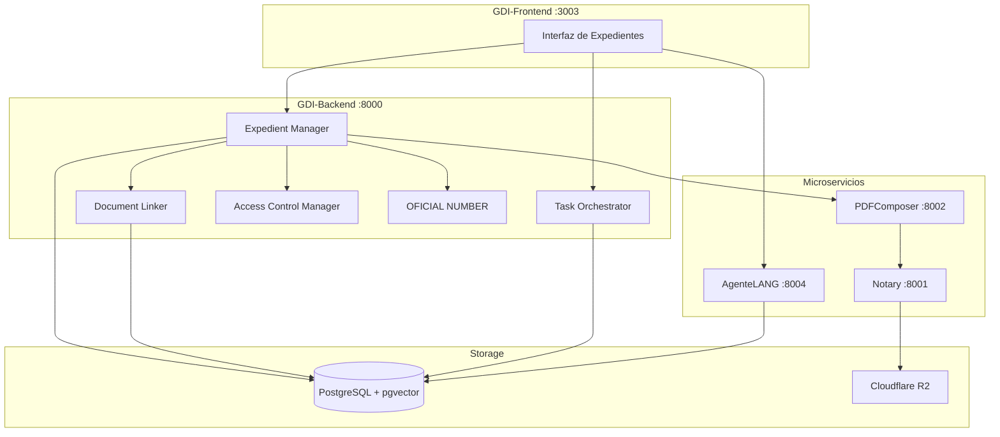
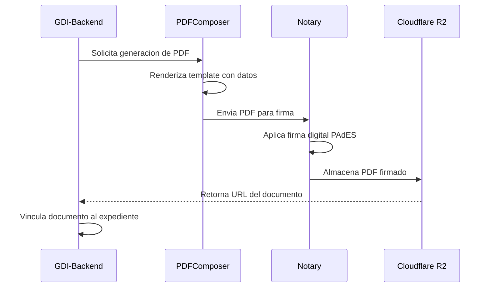

# Componentes Tecnicos del Sistema

## Arquitectura del Modulo Expedientes

El Modulo de Expedientes esta construido sobre una arquitectura de microservicios que garantiza escalabilidad, mantenibilidad y robustez en el procesamiento de tramites administrativos.

---

## Componentes Principales

| **Componente** | **Funcion Principal** | **Puerto/Servicio** |
|----------------|-----------------------|---------------------|
| **Expedient Manager** | Motor central de gestion de expedientes y flujos de trabajo | GDI-Backend :8000 |
| **Document Linker** | Servicio de vinculacion de documentos existentes al expediente | GDI-Backend :8000 |
| **Task Orchestrator** | Orquestador de solicitudes de actuacion inter-areas | GDI-Backend :8000 |
| **AI Assistant Engine** | Motor de inteligencia artificial para consultas conversacionales | GDI-AgenteLANG :8004 |
| **Access Control Manager** | Gestion granular de permisos (RBAC y ACLs) para expedientes | GDI-Backend :8000 |
| **OFICIAL NUMBER** | Servicio de numeracion oficial para expedientes y caratulas | GDI-Backend :8000 |
| **PDF Generator** | Generador automatico de caratulas y reportes de expedientes | GDI-PDFComposer :8002 |

---

## Servicios de Integracion

### Expedient Manager

- **Responsabilidad**: Coordina el ciclo de vida completo del expediente
- **Funciones**: Creacion, asignacion, transferencia y gestion de estados
- **Interfaces**: API REST para operaciones CRUD y flujos de trabajo

**Tabla principal: `cases`**

| Campo | Tipo | Descripcion |
|-------|------|-------------|
| `case_id` | UUID (PK) | Identificador unico del expediente |
| `case_number` | VARCHAR UNIQUE | Numero oficial EE-AAAA-NNNNNN-ECO-DEPT |
| `title` | TEXT | Titulo descriptivo del expediente |
| `description` | TEXT | Motivo o referencia del expediente |
| `status` | ENUM | Estado actual: active, inactive, archived |
| `sector_id` | UUID (FK) | Sector administrador actual |
| `created_by` | UUID (FK) | Usuario que creo el expediente |
| `assigned_to` | UUID (FK) | Usuario asignado como responsable |
| `template_id` | UUID (FK) | Tipo de expediente (plantilla) |
| `created_at` | TIMESTAMP | Fecha de creacion |
| `updated_at` | TIMESTAMP | Ultima modificacion |

### Document Linker

- **Responsabilidad**: Gestiona la vinculacion bidireccional con el Modulo Documentos
- **Funciones**: Vinculacion, subsanacion y trazabilidad de documentos
- **Interfaces**: Comunicacion asincrona con el servicio de documentos

**Tabla: `case_official_documents`**

| Campo | Tipo | Descripcion |
|-------|------|-------------|
| `id` | UUID (PK) | Identificador de la vinculacion |
| `case_id` | UUID (FK) | Expediente al que se vincula |
| `official_document_id` | UUID (FK) | Documento oficial vinculado |
| `order_number` | INTEGER | Orden secuencial dentro del expediente |
| `linked_at` | TIMESTAMP | Momento de la vinculacion |
| `linked_by` | UUID (FK) | Usuario que realizo la vinculacion |
| `status` | VARCHAR | Estado: active, subsanado |

### Task Orchestrator

- **Responsabilidad**: Coordina solicitudes de actuacion entre sectores
- **Funciones**: Creacion, asignacion, seguimiento y finalizacion de tareas
- **Interfaces**: Sistema de notificaciones y workflows dinamicos

**Tabla: `case_movements`**

| Campo | Tipo | Descripcion |
|-------|------|-------------|
| `movement_id` | UUID (PK) | Identificador del movimiento |
| `case_id` | UUID (FK) | Expediente asociado |
| `movement_type` | VARCHAR | Tipo: creation, transfer, assignment, document_added, action_request |
| `from_sector_id` | UUID (FK) | Sector de origen |
| `to_sector_id` | UUID (FK) | Sector de destino |
| `performed_by` | UUID (FK) | Usuario que realizo la accion |
| `description` | TEXT | Motivo del movimiento |
| `created_at` | TIMESTAMP | Fecha y hora del movimiento |
| `metadata` | JSONB | Datos adicionales del movimiento |

### AI Assistant Engine

- **Responsabilidad**: Proporciona capacidades de inteligencia artificial
- **Funciones**: Analisis conversacional, resumenes y sugerencias contextuales
- **Interfaces**: API de procesamiento de lenguaje natural

**Integracion tecnica:**

| Aspecto | Detalle |
|---------|---------|
| **Servicio** | GDI-AgenteLANG (:8004) |
| **Framework** | LangGraph con OpenRouter |
| **Busqueda semantica** | RAG con pgvector |
| **Aislamiento** | Chat privado por usuario y expediente |
| **Contexto** | Documentos vinculados + historial del expediente |

### Access Control Manager

- **Responsabilidad**: Gestiona permisos granulares y control de acceso
- **Funciones**: Validacion de permisos, RBAC y ACLs por expediente
- **Interfaces**: Middleware de autorizacion y auditoria

**Logica de permisos:**

| Nivel de Acceso | Condicion | Permisos |
|-----------------|-----------|----------|
| **Administrador** | Usuario pertenece al sector administrador del expediente | Gestion completa: vincular, transferir, solicitar actuacion, asignar |
| **Actuante** | Sector del usuario tiene una tarea activa en el expediente | Permisos limitados a la tarea: vincular documentos relacionados |
| **Solo lectura** | Usuario con permiso de visualizacion | Ver documentos y acciones, sin operar |

### OFICIAL NUMBER

- **Responsabilidad**: Genera identificadores unicos oficiales
- **Funciones**: Numeracion secuencial, validacion de unicidad
- **Interfaces**: Servicio transaccional con garantias de atomicidad

**Formato de numeracion:**

| Tipo | Formato | Ejemplo |
|------|---------|---------|
| Expediente | `EE-AAAA-NNNNNN-SIGLA_ECO-SIGLA_DEPT` | EE-2025-000123-TN-DGCO |
| Caratula | `CAEX-AAAA-NNNNNN-SIGLA_ECO-SIGLA_DEPT` | CAEX-2025-005000-TN-DGCO |
| Pase de Vista | `PV-AAAA-NNNNNN-SIGLA_ECO-SIGLA_DEPT` | PV-2025-001234-TN-DGCO |

### PDF Generator

- **Responsabilidad**: Genera documentos PDF automaticamente
- **Funciones**: Caratulas, pases de vista y reportes de expedientes
- **Interfaces**: Templates dinamicos y renderizado en tiempo real

**Documentos generados automaticamente:**

| Documento | Trigger | Firma |
|-----------|---------|-------|
| **Caratula (CAEX)** | Creacion de expediente | Firma automatica del creador |
| **Pase de Vista (PV)** | Transferencia de expediente | Firma automatica del transferente |

**Flujo de generacion:**

---

## Comunicacion entre Componentes

Todos los componentes internos se comunican via Railway internal URLs en produccion, lo que garantiza baja latencia y seguridad en la red:

| Origen | Destino | Protocolo | Proposito |
|--------|---------|-----------|-----------|
| Frontend | Backend | HTTPS REST | Operaciones de usuario |
| Backend | PDFComposer | HTTP interno | Generacion de PDFs |
| Backend | Notary | HTTP interno | Firma digital |
| Backend | AgenteLANG | HTTP interno | Consultas AI |
| Backend | PostgreSQL | TCP | Persistencia de datos |
| Notary | Cloudflare R2 | HTTPS S3 | Almacenamiento de archivos |
