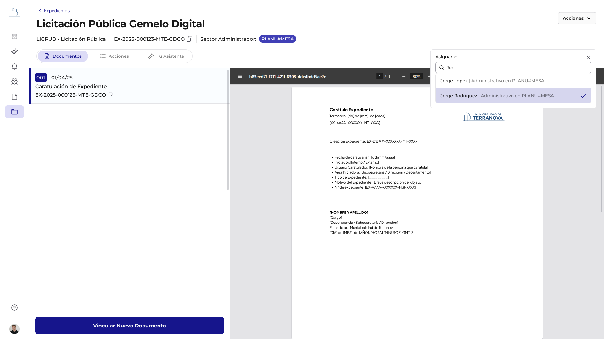
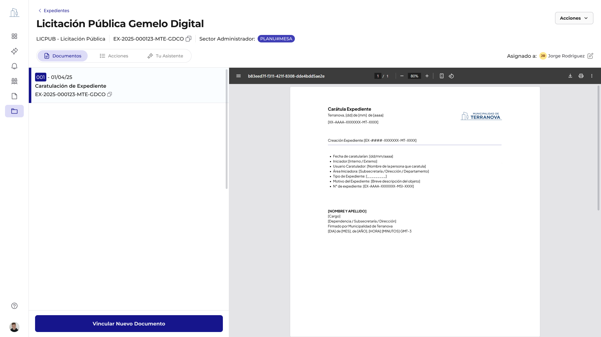
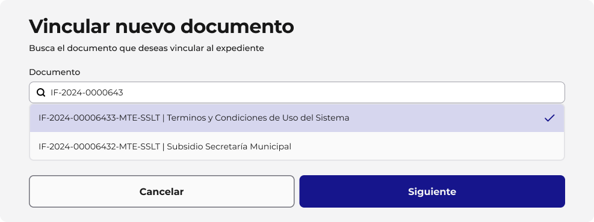
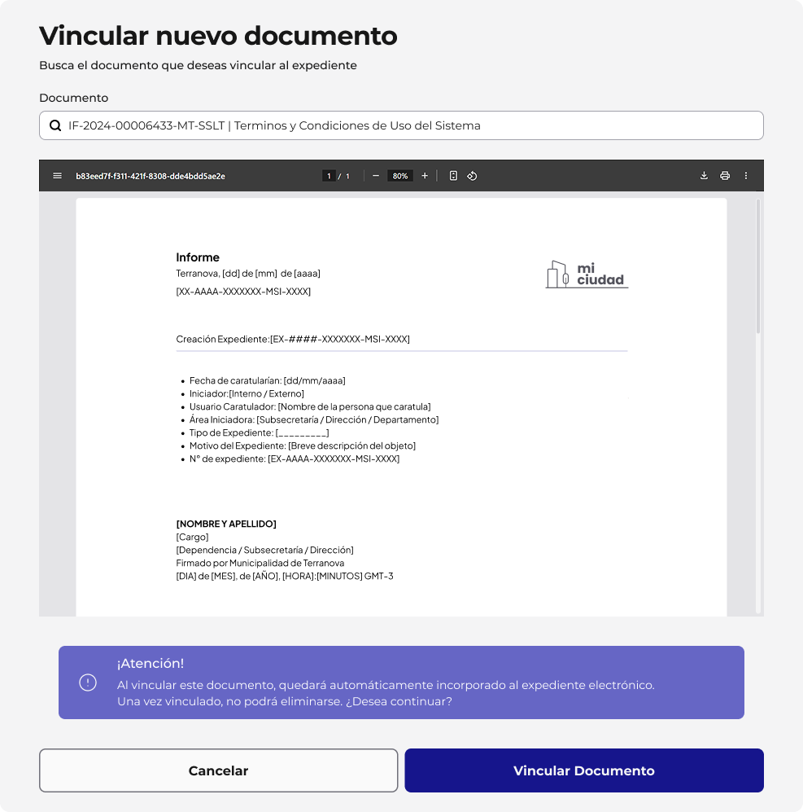
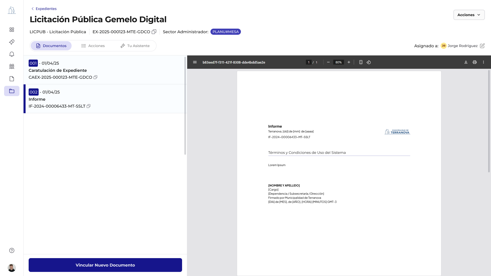
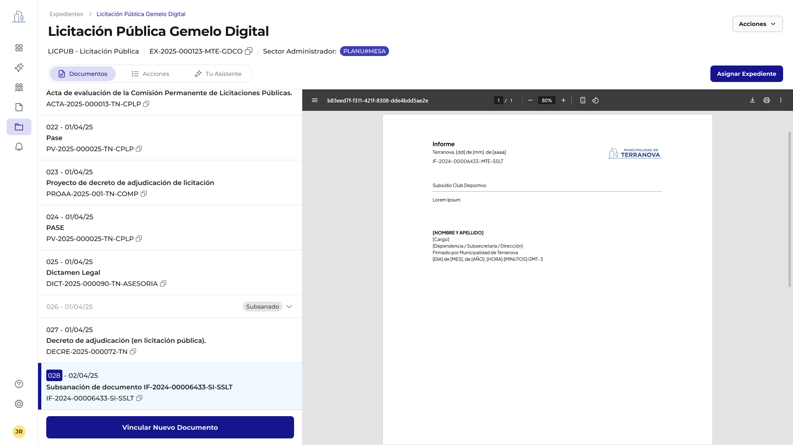
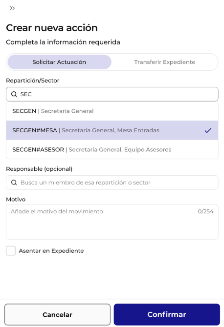
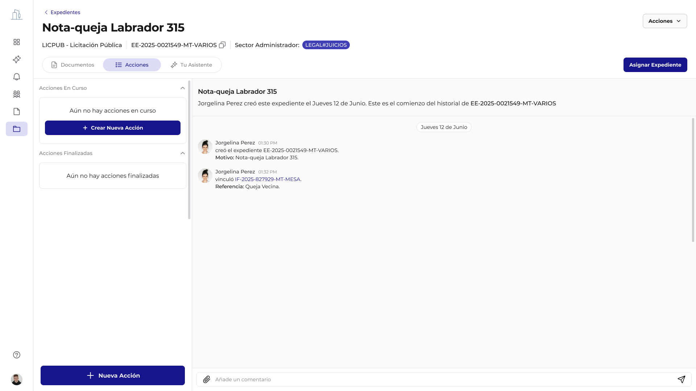
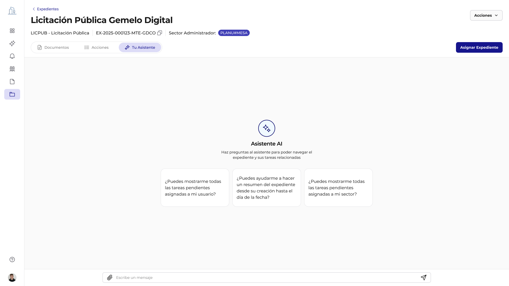

# Gestion Operativa del Expediente

Una vez creado el expediente, el usuario accede a una vista estructurada en tres secciones principales, cada una con funcionalidades especificas para gestionar el ciclo de vida del tramite.

El expediente entra inmediatamente en su fase operativa, donde los usuarios autorizados pueden:

- Vincular documentos al expediente
- Crear solicitudes de actuacion a otros sectores
- Asignar responsables dentro de la reparticion
- Consultar con el asistente AI
- Transferir la propiedad del expediente

---

## Asignacion de Expedientes

**Flujo en Figma:** [Asignacion de Expedientes](https://www.figma.com/design/QfYxAIYk97ZzvIU411ryLh/GDI---Expedientes?node-id=6796-14077&t=xkPc1JncRGCA4nzR-4)

La funcionalidad de Asignar Expediente en GDI es una caracteristica clave que potencia la colaboracion y la eficiencia en la gestion. Permite designar un responsable dentro de la reparticion administradora para el seguimiento y gestion de un expediente. Es un dato informal que fundamentalmente propicia designar un responsable de tramitacion.

**Proceso de asignacion**:

1. **Acceso a la opcion de asignacion**: Desde la vista del expediente, el usuario puede acceder a la opcion de "Asignar" el expediente

2. **Busqueda y seleccion de usuarios**: Se presenta una interfaz donde se puede buscar y seleccionar al usuario que desea asignar el expediente. El sistema permite buscar por nombre o rol

3. **Confirmacion de asignacion**: Una vez seleccionado el usuario, se confirma la asignacion. Esto no tiene impacto formal en el expediente

---

## Secciones Funcionales del Expediente

### Seccion Documentos

Esta pestaña permite visualizar y gestionar todos los documentos vinculados que conforman el expediente, en orden cronologico. Cada documento esta ordenado segun orden de vinculacion.

#### Funciones destacadas

- **Visualizacion secuencial** de los documentos vinculados en orden cronologico
- **Acceso directo** al visor de documentos (formato PDF)
- **Identificacion** por tipo, fecha y numero
- **Boton "Vincular nuevo documento"** para agregar nuevos registros al expediente
- **Boton Acciones** donde se encuentra la opcion de Subsanar documento, descargar documento y tambien "vincular"
- **Asignacion de expediente** a usuarios

#### Vinculacion de documentos

**Flujo en Figma:** [Vinculacion de Documentos](https://www.figma.com/design/QfYxAIYk97ZzvIU411ryLh/GDI---Expedientes?node-id=6803-9806&t=xkPc1JncRGCA4nzR-4)

**Proceso**: Desde la vista detallada del expediente, el usuario puede iniciar la accion de "Vincular Documento". Se abre una interfaz que permite buscar y seleccionar documentos ya existentes en GDI.

Una vez seleccionado el documento se abre una previsualizacion del numero de documento seleccionado y una vez confirmado quedan asociados al expediente, manteniendo su trazabilidad y versiones.

**Proposito**: Asociar documentos existentes (gestionados por el Modulo Documentos) al expediente, enriqueciendo su contenido y proporcionando la informacion necesaria para su tramitacion.

**Impacto**: Los documentos vinculados se visualizan dentro del expediente en orden cronologico de su vinculacion, formando parte de su contenido integral.

#### Subsanacion de documentos

**Flujo en Figma:** [Subsanacion de Documentos](https://www.figma.com/design/QfYxAIYk97ZzvIU411ryLh/GDI---Expedientes?node-id=6803-13855&t=xkPc1JncRGCA4nzR-4)

**Proposito**: Permite reemplazar un documento previamente vinculado al expediente, manteniendo un registro. Esto es crucial para corregir errores sin perder el historial. Se debe vincular un documento para justificar la accion.

**Proceso**:

1. Desde el boton superior de "Acciones", el usuario puede seleccionar un documento y optar por "Subsanar"
2. Se le guiara para cargar la nueva version del documento
3. Se vincula un documento de justificacion obligatorio

**Impacto**: El documento original vinculado cambia su estado a SUBSANADO, y la justificacion se vincula al expediente, asegurando la integridad del historial.

#### Descarga del Expediente

**Proposito**: Permitir a los usuarios descargar una copia del expediente en formato comprimido en cualquier momento del proceso.

**Proceso**: Una funcionalidad de "Descargar" esta disponible en la seccion "Acciones", permitiendo obtener un archivo .zip con todos los documentos del expediente.

---

### Seccion Acciones

La seccion de "Acciones" dentro del Modulo de un Expediente es el centro neuralgico para la gestion dinamica y colaborativa de los tramites. Permite a los usuarios iniciar y gestionar diversas actividades que impulsan el expediente a traves de sus diferentes etapas, asegurando la comunicacion y la coordinacion entre las distintas areas involucradas.

Desde esta area, el usuario puede visualizar el historial de acciones, las acciones en curso y las acciones finalizadas, proporcionando una vision completa del progreso del expediente.

#### Solicitud de Actuacion: Requerimientos Inter-areas

**Flujo en Figma:** [Solicitud de Actuacion](https://www.figma.com/design/QfYxAIYk97ZzvIU411ryLh/GDI---Expedientes?node-id=7203-8422&t=xkPc1JncRGCA4nzR-4)

La funcionalidad de "Solicitar Actuacion" es una herramienta fundamental para la coordinacion entre sectores. Permite a un usuario requerir una accion especifica a un sector determinado, asegurando que las tareas necesarias para el avance del expediente sean ejecutadas de manera eficiente.

**Proceso de solicitud de actuacion**:

1. **Inicio de una nueva accion**: desde la seccion "Acciones" del expediente, el usuario selecciona la opcion "Crear nueva accion". Esto abre un formulario para configurar la solicitud.

2. **Seleccion de "Solicitar Actuacion"**:

    - **Definicion de la Reparticion#Sector Requerido**: El usuario debe especificar la Reparticion#Sector al que se dirige la solicitud. El sistema ofrece un campo de busqueda (Sector) que permite encontrar y seleccionar el sector deseado (ej., "SECGEN | Secretaria General, Privada.", "SECGEN#MESA | Secretaria General, Mesa Entradas").

    - **Asignacion de Responsable (Opcional)**: el usuario puede asignar la actuacion a un Responsable especifico dentro del sector seleccionado a traves de un campo de busqueda que permite encontrar miembros de dicho sector.

    - **Especificacion del Motivo**: Es obligatorio anadir un Motivo que describa claramente el proposito de la solicitud de actuacion. Este campo tiene un limite de 254 caracteres.

    - **Asentar en Expediente (Opcional)**: El usuario puede optar por "Asentar en Expediente" la solicitud, lo que significa que esta accion quedara registrada formalmente en los documentos del expediente como un "Pase en Paralelo", "Providencia Interna" o el tipo correspondiente segun definicion en BackOffice. Si es asentada en la "ida" sera asentada la "vuelta"; toda "Solicitar Actuacion" debera tener cierre.

    - **Confirmacion de la Solicitud**: Una vez completados los campos, el usuario confirma la solicitud. El sistema registra la actuacion y la notifica en el panel de expedientes al sector y responsable designado.

#### Transferencia de expediente: cambio de propiedad y responsabilidad

La funcionalidad de **Transferir expediente** es una accion critica dentro del Modulo Expediente que permite cambiar la propiedad y, por ende, la responsabilidad principal de un expediente de una reparticion o usuario a otro. Esta accion es fundamental para la correcta gestion de los flujos de trabajo que requieren un cambio formal en la titularidad del tramite.

No es solo una reasignacion de tareas, sino un cambio formal en la entidad (reparticion#sector) que tiene la responsabilidad principal sobre el expediente. Esto asegura que el control y la gestion del expediente recaigan en la unidad administrativa correcta en cada etapa de su ciclo de vida.

La transferencia se realiza mediante el mismo proceso que la solicitud de actuacion, utilizando la funcionalidad **"Nueva accion"** desde la pestaña de Acciones. La diferencia radica en el motivo y la intencion de la accion: en este caso, se explicita que el expediente pasara a ser gestionado por la nueva reparticion/sector asignada, perdiendo la reparticion-sector emisora los permisos sobre el expediente.

!!! warning "Accion con impacto formal"
    La transferencia genera automaticamente un Pase de Vista (PV) firmado digitalmente, y el sector emisor pierde todos los permisos de gestion sobre el expediente.

#### Panel de acciones

Una vez realizada la solicitud de actuacion, esta queda registrada en el panel de Acciones, desde donde se puede hacer seguimiento en tiempo real. El usuario puede ver:

- **Acciones en curso**: todas las solicitudes activas enviadas a otras reparticiones, con opcion de finalizarlas una vez respondidas
- **Tareas finalizadas**: solicitudes ya resueltas, archivadas para consulta
- **Historial completo**: listado cronologico de todas las acciones, usuarios involucrados, fechas y comentarios intercambiados

---

### Seccion Asistente AI

**Flujo en Figma:** [Asistente AI](https://www.figma.com/design/QfYxAIYk97ZzvIU411ryLh/GDI---Expedientes?node-id=6803-14625&t=xkPc1JncRGCA4nzR-4)

El Asistente de IA integrado en cada expediente transforma la manera en que los usuarios interactuan con la informacion y gestionan sus tramites. Esta funcionalidad nativa de inteligencia artificial permite una consulta conversacional, resumenes rapidos y la identificacion de tareas pendientes, optimizando la eficiencia y la toma de decisiones.

Es una interfaz conversacional que utiliza procesamiento de lenguaje natural para entender las consultas de los usuarios y proporcionar respuestas relevantes basadas en el contenido y el estado del expediente. Actua como un copiloto inteligente, facilitando el acceso a la informacion y la ejecucion de tareas.

#### Interfaz del Asistente de IA

La interfaz del Asistente de IA se presenta como un chat, donde el usuario puede escribir sus preguntas y recibir respuestas. Se ofrecen sugerencias de preguntas frecuentes para facilitar la interaccion inicial:

- "Puedes mostrarme todas las tareas pendientes asignadas a mi usuario?"
- "Puedes ayudarme a trazar un resumen del expediente y su situacion al dia de la fecha?"

!!! info "Chat privado"
    El chat con el Asistente AI es privado entre el agente y el usuario. Cada usuario tiene su propia conversacion independiente, sin acceso cruzado.
