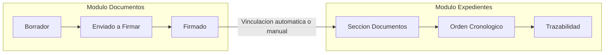

# Integracion con Modulo Documentos

## Vinculacion Bidireccional

El Modulo Expedientes mantiene una integracion estrecha con el Modulo Documentos de GDI, estableciendo una relacion bidireccional que potencia las capacidades de ambos sistemas.

### Desde Expedientes hacia Documentos

- **Busqueda de documentos existentes**: El sistema permite buscar documentos ya creados en GDI por numero oficial, tipo o contenido

- **Vinculacion sin duplicacion**: Los documentos mantienen su integridad y versionado original. La vinculacion se registra en la tabla `case_official_documents`, almacenando el `official_document_id` junto con metadatos de vinculacion y el `order_number` secuencial

- **Referencia cruzada**: Los documentos vinculados mantienen referencia al expediente en sus metadatos

### Desde Documentos hacia Expedientes

- **Campo "Vincular a expediente"**: Durante la creacion de documentos oficiales, se puede especificar vinculacion automatica a un expediente

- **Vinculacion post-firma**: Una vez firmado y numerado el documento, se ejecuta automaticamente la vinculacion al expediente especificado

- **Busqueda de expedientes**: El sistema permite localizar expedientes por numero oficial para vinculacion

---

## Flujo de Integracion



### Vinculacion Manual (desde Expedientes)

1. El usuario accede a la seccion "Documentos" del expediente
2. Selecciona "Vincular nuevo documento"
3. Busca el documento oficial por numero, tipo o contenido
4. Previsualiza el documento seleccionado
5. Confirma la vinculacion
6. El documento se agrega con el siguiente `order_number` disponible

### Vinculacion Automatica (desde Documentos)

1. Durante la creacion de un documento, el usuario selecciona "Vincular a expediente"
2. Busca y selecciona el expediente destino
3. Al completarse la firma del documento, la vinculacion se ejecuta automaticamente
4. El documento aparece en la seccion Documentos del expediente

---

## Documentos Generados Automaticamente

Ademas de documentos vinculados manualmente, el sistema genera documentos automaticamente como parte de los flujos de expedientes:

| Documento | Momento de Generacion | Servicio | Firma |
|-----------|----------------------|----------|-------|
| **Caratula (CAEX)** | Creacion del expediente | PDFComposer + Notary | Automatica (creador) |
| **Pase de Vista (PV)** | Transferencia del expediente | PDFComposer + Notary | Automatica (transferente) |

Estos documentos se vinculan automaticamente al expediente como parte de su historial oficial.

---

## Casos de Uso de Integracion

### Creacion reactiva
Se crea un expediente para agrupar documentos ya existentes relacionados. Util cuando se necesita formalizar un tramite a partir de documentos dispersos.

### Creacion proactiva
Se crea el expediente primero y luego se van vinculando documentos conforme se generan. Es el flujo mas comun para tramites nuevos.

### Documentos transversales
Un mismo documento puede estar vinculado a multiples expedientes. Por ejemplo, un dictamen legal puede ser relevante para varios tramites simultaneamente.

### Subsanacion integrada
Al subsanar un documento en el expediente, se mantiene la referencia al documento original marcado como SUBSANADO y se vincula la nueva version junto con el documento de justificacion.

---

## Modelo de Datos de la Integracion

La relacion entre expedientes y documentos se gestiona a traves de la tabla `case_official_documents`:

```sql
-- Relacion entre expedientes y documentos
case_official_documents (
    case_id        UUID FK -> cases,
    official_document_id  UUID FK -> official_documents,
    order_number   INTEGER,  -- Orden secuencial de vinculacion
    linked_at      TIMESTAMP,
    linked_by      UUID FK -> users,
    status         VARCHAR   -- active, subsanado
)
```

!!! tip "Orden de Documentos"
    El `order_number` se asigna secuencialmente segun el orden de vinculacion. La caratula siempre tiene `order_number = 1` por ser el primer documento generado automaticamente.

---

## Beneficios de la Integracion

| Beneficio | Descripcion |
|-----------|-------------|
| **Trazabilidad completa** | Vision integral del flujo documental y administrativo |
| **Eficiencia operativa** | Evita duplicacion de esfuerzos y mantiene consistencia |
| **Auditoria unificada** | Logs coordinados entre ambos modulos |
| **Busqueda transversal** | Posibilidad de localizar informacion desde cualquier punto de entrada |
| **Integridad referencial** | Los documentos mantienen su version original al ser vinculados |
