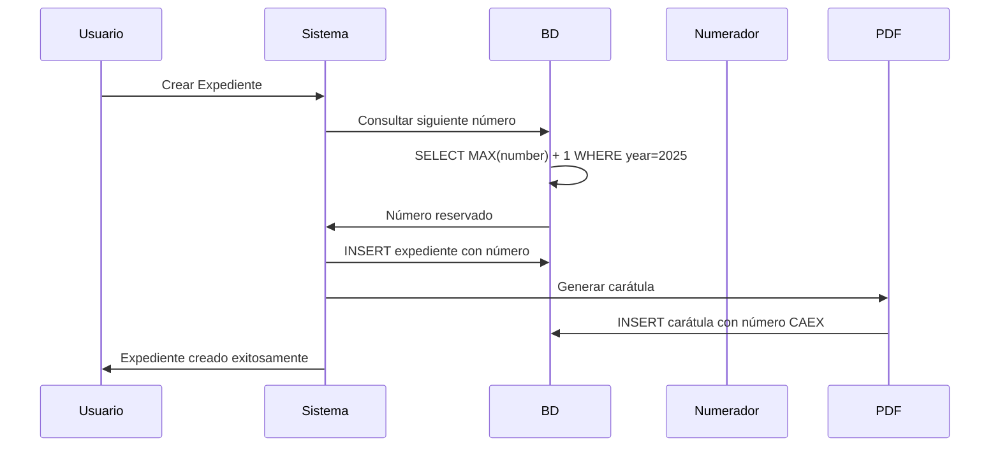

# Nomenclatura y Numeracion de IDs - Modulo Expedientes

## Objetivo del Sistema de Numeracion

El sistema de numeración de expedientes en GDI garantiza la **asignación única, secuencial y trazable** de identificadores que cumplen con normativas municipales, permiten búsqueda eficiente, auditoría completa y validación legal de todos los trámites administrativos.

---

## Arquitectura de la Numeracion

### Tabla Principal: `expedients`

```sql
CREATE TABLE expedients (
    expedient_id UUID PRIMARY KEY,
    expedient_type_id UUID NOT NULL,
    expedient_number VARCHAR UNIQUE NOT NULL, -- Número oficial completo
    reference TEXT NOT NULL,                  -- Motivo del expediente
    year SMALLINT NOT NULL,                  -- Año de creación
    created_by UUID NOT NULL,                -- Usuario creador
    admin_department_id UUID NOT NULL,       -- Repartición administradora
    initiator_type initiator_type_enum,      -- INTERNAL/EXTERNAL
    initiator_details JSONB,                 -- Datos del iniciador
    status expedient_status DEFAULT 'active',
    created_at TIMESTAMP DEFAULT NOW()
);
```

### Tabla de Carátulas: `expedient_covers`

```sql
CREATE TABLE expedient_covers (
    cover_id UUID PRIMARY KEY,
    expedient_id UUID NOT NULL,
    cover_number VARCHAR UNIQUE NOT NULL,    -- CAEX-AAAA-NNNNNN-SIGLA-DEPT
    cover_pdf_url VARCHAR NOT NULL,          -- PDF de la carátula generada
    created_by UUID NOT NULL,               -- Usuario que caratuló
    signed_at TIMESTAMP DEFAULT NOW()       -- Momento de firma automática
);
```

---

## Formato Estandar de Numeracion

### 1. Expediente Principal

**Estructura:** `EE-<AAAA>-<NNNNNN>-<SIGLA_ECO>-<SIGLA_REPARTICIÓN>`

**Ejemplo Completo:** `EE-2025-000123-TN-DGCO`

#### Desglose de Componentes

```
EE - 2025 - 000123 - TN - DGCO
│    │      │        │    │
│    │      │        │    └─→ Repartición administradora (ej. Dir. Gral. de Compras)
│    │      │        └─→ Sigla del ecosistema/municipio (ej. Terranova)
│    │      └─→ Número correlativo secuencial por año (6 dígitos)
│    └─→ Año de creación del expediente
└─→ Identificador de tipo (EE = Expediente)
```

### 2. Carátula del Expediente

**Estructura:** `CAEX-<AAAA>-<NNNNNN>-<SIGLA_ECO>-<SIGLA_REPARTICIÓN>`

**Ejemplo Completo:** `CAEX-2025-005000-TN-DGCO`

#### Características Especiales de la Carátula

- **Numeración independiente**: La carátula tiene su propia secuencia correlativa
- **Coexistencia**: Convive con el número del expediente al que pertenece
- **Documento oficial**: Es en sí misma un documento con validez legal
- **Firma automática**: Se firma digitalmente al momento de creación

---

## Tabla de Componentes Detallada

| **Componente** | **Descripción** | **Fuente en BD** | **Ejemplos** | **Reglas** |
|----------------|-----------------|------------------|-------------|------------|
| **EE/CAEX** | Tipo de entidad | Fijo en sistema | EE, CAEX | Inmutable |
| **AAAA** | Año de creación | `EXTRACT(YEAR FROM created_at)` | 2025, 2024 | Automático |
| **NNNNNN** | Número correlativo | Secuencia por tipo/año | 000001, 000123 | 6 dígitos con ceros |
| **SIGLA_ECO** | Sigla del municipio | `municipalities.acronym` | TN, MDQ, CBA | Configurado en Backoffice |
| **SIGLA_REPARTICIÓN** | Sigla repartición administradora | `departments.acronym` | DGCO, SECGOB, INTEN | Según configuración |

---

## Logica de Asignacion de Reparticion

### Configuración en `expedient_types`

```sql
-- Configuración de tipos de expediente
CREATE TABLE expedient_types (
    expedient_type_id UUID PRIMARY KEY,
    name VARCHAR NOT NULL,                    -- "Licitación Pública"
    acronym VARCHAR NOT NULL,                 -- "LICPUB"
    enabled_departments JSONB,                -- Quién puede crear
    admin_department_assignment_type VARCHAR, -- "creator" | "specific"
    specific_admin_department_id UUID        -- Si es específica
);
```

### Dos Modelos de Asignación

#### 1. **Repartición Creadora** (Dinámica)
```sql
admin_department_assignment_type = 'creator'
specific_admin_department_id = NULL
```

**Comportamiento:**
- El department que crea el expediente se convierte en administrador
- La sigla en el número varía según quién lo cree

**Ejemplo:**
```
Usuario: María García (SECGOB) crea expediente OBRA
Resultado: EE-2025-000456-TN-SECGOB
```

#### 2. **Repartición Específica** (Fija)
```sql
admin_department_assignment_type = 'specific'
specific_admin_department_id = 'uuid-direccion-compras'
```

**Comportamiento:**
- Siempre la misma repartición será administradora
- La sigla en el número es siempre la misma


**Ejemplo:**
```
Usuario: Juan Pérez (MESA) crea expediente LICPUB
Configuración: admin = "Dirección de Compras" 
Resultado: EE-2025-000789-TN-DGCO (siempre DGCO)
```

---

## Proceso de Numeracion Automatica

### Flujo Completo de Creación



### Generación Secuencial por Año

```sql
-- Algoritmo de numeración implementado
WITH next_expedient_number AS (
    SELECT 
        COALESCE(MAX(
            CAST(SPLIT_PART(expedient_number, '-', 3) AS INTEGER)
        ), 0) + 1 as next_number
    FROM expedients
    WHERE year = EXTRACT(YEAR FROM NOW())
      AND expedient_number LIKE 'EX-' || EXTRACT(YEAR FROM NOW()) || '-%'
)
SELECT 
    CONCAT(
        'EX-',
        EXTRACT(YEAR FROM NOW()), '-',
        LPAD(next_number::TEXT, 6, '0'), '-',
        m.acronym, '-',
        d.acronym
    ) as full_expedient_number
FROM next_expedient_number, municipalities m, departments d
WHERE m.id_municipality = ? AND d.department_id = ?;
```

---

## Sistema de Caratulas Automaticas

### Generación Simultánea

Cuando se crea un expediente, **automáticamente** se genera:

1. **Expediente**: `EE-2025-000123-TN-DGCO`
2. **Carátula**: `CAEX-2025-005000-TN-DGCO`

### Diferencias Clave

| **Aspecto** | **Expediente** | **Carátula** |
|-------------|---------------|--------------|
| **Propósito** | Contenedor del trámite | Documento PDF oficial |
| **Numeración** | Secuencia EE | Secuencia CAEX independiente |
| **Contenido** | Metadatos del trámite | PDF con datos de creación |
| **Firma** | No se firma | Firma automática del creador |
| **Búsqueda** | Por número o contenido | Por número de carátula |

### Contenido de la Carátula

```json
{
  "expedient_data": {
    "expedient_number": "EE-2025-000123-TN-DGCO",
    "created_date": "2025-01-15",
    "expedient_type": "Licitación Pública",
    "reference": "Licitación para compra de equipos informáticos",
    "creator": "Juan López DGCO#COMP",
    "admin_department": "Dirección General de Compras - DGCO",
    "initiator_type": "Externo (Ciudadano)"
  },
  "institutional_data": {
    "municipality": "Terranova",
    "date_created": "15 de enero de 2025",
    "cover_number": "CAEX-2025-005000-TN-DGCO"
  }
}
```

---

## Busquedas y Validaciones

### Búsqueda por Número Oficial

```sql
-- Búsqueda exacta de expediente
SELECT 
    e.*,
    et.name as expedient_type_name,
    d.name as admin_department_name,
    u.full_name as creator_name
FROM expedients e
JOIN expedient_types et ON e.expedient_type_id = et.expedient_type_id
JOIN departments d ON e.admin_department_id = d.department_id
JOIN users u ON e.created_by = u.user_id
WHERE e.expedient_number = 'EX-2025-000123-TN-DGCO';
```

### Búsqueda por Componentes

```sql
-- Expedientes por año y tipo
SELECT expedient_number, reference, created_at
FROM expedients e
JOIN expedient_types et ON e.expedient_type_id = et.expedient_type_id
WHERE et.acronym = 'LICPUB'  -- Licitaciones públicas
  AND e.year = 2025
ORDER BY e.expedient_number;
```

### Validación de Formato

```sql
-- Función de validación de formato
CREATE OR REPLACE FUNCTION validate_expedient_number(exp_number VARCHAR)
RETURNS BOOLEAN AS $$
BEGIN
    RETURN exp_number ~ '^EX-\d{4}-\d{6}-[A-Z]{2,10}-[A-Z]{2,10}$';
END;
$$ LANGUAGE plpgsql;
```

---

## Configuracion por Municipio

### Personalización de Formato

```sql
CREATE TABLE municipality_expedient_config (
    municipality_id UUID PRIMARY KEY,
    expedient_prefix VARCHAR DEFAULT 'EX',      -- Personalizable
    cover_prefix VARCHAR DEFAULT 'CAEX',        -- Personalizable
    number_padding INTEGER DEFAULT 6,           -- Dígitos del número
    separator VARCHAR DEFAULT '-',              -- Separador entre componentes
    year_format VARCHAR DEFAULT 'YYYY',         -- Formato del año
    reset_yearly BOOLEAN DEFAULT true           -- Reinicio anual
);
```

---

## Control de Integridad y Unicidad

### Constraints de Base de Datos

```sql
-- Constraints implementados
ALTER TABLE expedients 
ADD CONSTRAINT unique_expedient_number UNIQUE (expedient_number);

ALTER TABLE expedient_covers
ADD CONSTRAINT unique_cover_number UNIQUE (cover_number);

-- Índices para optimización
CREATE INDEX idx_expedients_year ON expedients(year);
CREATE INDEX idx_expedients_type ON expedients(expedient_type_id);
CREATE INDEX idx_expedients_department ON expedients(admin_department_id);
```

### Validaciones de Negocio

```sql
-- Trigger de validación antes de INSERT
CREATE OR REPLACE FUNCTION validate_expedient_before_insert()
RETURNS TRIGGER AS $$
BEGIN
    -- Validar formato
    IF NOT validate_expedient_number(NEW.expedient_number) THEN
        RAISE EXCEPTION 'Invalid expedient number format: %', NEW.expedient_number;
    END IF;
    
    -- Validar año coincide con created_at
    IF NEW.year != EXTRACT(YEAR FROM NEW.created_at) THEN
        RAISE EXCEPTION 'Year mismatch between number and creation date';
    END IF;
    
    RETURN NEW;
END;
$$ LANGUAGE plpgsql;

CREATE TRIGGER trigger_validate_expedient
    BEFORE INSERT ON expedients
    FOR EACH ROW
    EXECUTE FUNCTION validate_expedient_before_insert();
```

---

## Metricas y Estadisticas

### Análisis de Numeración

```sql
-- Estadísticas de expedientes por tipo y año
SELECT 
    et.name,
    e.year,
    COUNT(*) as total_expedients,
    MIN(e.expedient_number) as first_expedient,
    MAX(e.expedient_number) as last_expedient,
    d.name as admin_department
FROM expedients e
JOIN expedient_types et ON e.expedient_type_id = et.expedient_type_id
JOIN departments d ON e.admin_department_id = d.department_id
WHERE e.year >= 2024
GROUP BY et.name, e.year, d.name
ORDER BY e.year DESC, et.name;
```

### Distribución por Repartición

```sql
-- Expedientes por repartición administradora
SELECT 
    d.name as department,
    d.acronym,
    COUNT(e.expedient_id) as total_expedients,
    ROUND(
        COUNT(e.expedient_id) * 100.0 / 
        (SELECT COUNT(*) FROM expedients WHERE year = 2025), 
        2
    ) as percentage
FROM departments d
LEFT JOIN expedients e ON d.department_id = e.admin_department_id 
    AND e.year = 2025
GROUP BY d.department_id, d.name, d.acronym
ORDER BY total_expedients DESC;
```

---

## Comandos de Administracion

### Verificación de Integridad

```sql
-- Detectar gaps en numeración
WITH RECURSIVE number_series AS (
    SELECT 1 as num
    UNION ALL
    SELECT num + 1
    FROM number_series
    WHERE num < (
        SELECT MAX(CAST(SPLIT_PART(expedient_number, '-', 3) AS INTEGER))
        FROM expedients
        WHERE year = 2025
    )
)
SELECT ns.num as missing_number
FROM number_series ns
LEFT JOIN expedients e ON 
    CAST(SPLIT_PART(e.expedient_number, '-', 3) AS INTEGER) = ns.num
    AND e.year = 2025
WHERE e.expedient_id IS NULL;
```

### Corrección de Secuencias

```sql
-- Función para corregir numeración si es necesario
CREATE OR REPLACE FUNCTION fix_expedient_sequence(target_year INTEGER)
RETURNS TEXT AS $$
DECLARE
    fixed_count INTEGER := 0;
    exp_record RECORD;
    new_number INTEGER := 1;
BEGIN
    FOR exp_record IN 
        SELECT expedient_id, expedient_number, created_at
        FROM expedients 
        WHERE year = target_year
        ORDER BY created_at
    LOOP
        UPDATE expedients 
        SET expedient_number = REGEXP_REPLACE(
            expedient_number, 
            '-\d{6}-', 
            '-' || LPAD(new_number::TEXT, 6, '0') || '-'
        )
        WHERE expedient_id = exp_record.expedient_id;
        
        new_number := new_number + 1;
        fixed_count := fixed_count + 1;
    END LOOP;
    
    RETURN 'Fixed ' || fixed_count || ' expedients for year ' || target_year;
END;
$$ LANGUAGE plpgsql;
```

---

## Integracion con Documentos

### Vinculación Automática

Cuando se crea un expediente, la carátula se genera como un documento oficial:

```sql
-- La carátula se registra también en el módulo documentos
INSERT INTO official_documents (
    document_id,
    official_number,
    document_type_id, -- Tipo "Carátula de Expediente"
    reference,
    content,
    numerator_id,
    signed_at,
    expedient_id -- Referencia al expediente
) VALUES (...);
```

### Búsqueda Transversal

```sql
-- Encontrar todos los documentos de un expediente
SELECT 
    'EXPEDIENT' as type,
    e.expedient_number as number,
    e.reference,
    e.created_at
FROM expedients e
WHERE e.expedient_number = 'EX-2025-000123-TN-DGCO'

UNION ALL

SELECT 
    'COVER' as type,
    ec.cover_number as number,
    'Carátula del expediente' as reference,
    ec.signed_at as created_at
FROM expedient_covers ec
JOIN expedients e ON ec.expedient_id = e.expedient_id
WHERE e.expedient_number = 'EE-2025-000123-TN-DGCO'

UNION ALL

SELECT 
    'DOCUMENT' as type,
    od.official_number as number,
    od.reference,
    od.signed_at as created_at
FROM official_documents od
WHERE od.expedient_id = (
    SELECT expedient_id FROM expedients 
    WHERE expedient_number = 'EX-2025-000123-TN-DGCO'
)
ORDER BY created_at;
```

---

## Casos de Uso Practicos

### Caso 1: Licitación Pública Centralizada

```
Configuración:
- Tipo: "Licitación Pública" (LICPUB)
- Enabled departments: TODAS
- Admin assignment: ESPECÍFICA -> Dirección de Compras (DGCO)

Flujo:
1. María (MESA) inicia expediente LICPUB
2. Sistema asigna: EE-2025-001234-TN-DGCO
3. Carátula generada: CAEX-2025-007890-TN-DGCO
4. Administración: Dirección de Compras
5. Actuante: Mesa de Entradas (pueden vincular documentos)
```

### Caso 2: Trámite de Obras por Área

```
Configuración:
- Tipo: "Permiso de Obra" (OBRA)
- Enabled departments: OBRAS, PLANEAMIENTO
- Admin assignment: CREADORA

Flujo:
1. Juan (OBRAS) inicia expediente OBRA
2. Sistema asigna: EE-2025-000567-TN-OBRAS
3. Carátula generada: CAEX-2025-008901-TN-OBRAS
4. Administración: Dirección de Obras (quien lo creó)
```

---

## Checklist de Implementacion

### Completado

- [x] Numeracion secuencial por año
- [x] Formato estandar EE-AAAA-NNNNNN-ECO-DEPT
- [x] Generacion automatica de caratulas
- [x] Configuracion por tipo de expediente
- [x] Validacion de formato y unicidad
- [x] Control de integridad en BD

### En Desarrollo

- [ ] Configuracion personalizada por municipio
- [ ] Migracion de numeracion historica
- [ ] Dashboard de estadisticas avanzadas
- [ ] Alertas de inconsistencias automaticas

### Pendiente

- [ ] Numeracion para sub-expedientes
- [ ] Archivado automatico con preservacion
- [ ] Integracion con sistemas de archivo historico
- [ ] APIs publicas de consulta de expedientes

---

## Referencias

- [Casos de Uso del Modulo Expedientes](./casos-uso.md)
- [Integracion con Modulo Documentos](./integracion-documentos.md)
- [Modelo de Datos](./modelo-datos-exp.md)