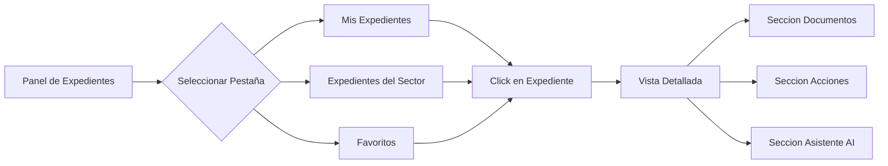

# Panel de Expedientes y Navegacion

El Panel de Expedientes es la interfaz principal del Modulo Expediente, diseñada para ofrecer a los usuarios una vision integral y organizada de todos los tramites activos en el sistema.

Su estructura en forma de tabla facilita la lectura rapida y ordenada de la informacion clave de cada expediente, permitiendo una gestion eficiente y un acceso agil a los detalles necesarios.

---

## Navegacion por pestañas: vistas personalizadas

El Panel de Expedientes organiza la informacion en pestañas intuitivas, proporcionando vistas personalizadas que se adaptan a las necesidades y roles de cada usuario. Esto mejora la usabilidad y permite un acceso rapido a los expedientes mas relevantes para el trabajo diario.

### 1. Mis Expedientes

Esta pestaña muestra todos los expedientes donde el usuario es responsable del expediente al haber sido asignado como tal para su totalidad o una actuacion especifica. Es la vista predeterminada para la mayoria de los usuarios, ya que centraliza los tramites de los que son directamente responsables. Ademas aparecen todos los marcados como "favorito".

Permite un seguimiento directo de los expedientes que requieren su atencion y gestion activa.

!!! info "Vista por defecto"
    "Mis Expedientes" es la pestaña que se muestra al ingresar al modulo. Incluye expedientes asignados al usuario y los marcados como favoritos.

### 2. Expedientes de mi sector

Esta pestaña ofrece una vista compartida de todos los expedientes asociados al sector o reparticion del usuario, sea porque es el administrador o se le solicito una actuacion.

Facilita la coordinacion y el trabajo en equipo, asegurando que todos los miembros del sector tengan acceso y visibilidad sobre los expedientes en curso.

### 3. Expedientes Favoritos

Esta funcionalidad permite a los usuarios guardar manualmente expedientes especificos para un seguimiento frecuente y rapido. Los expedientes marcados como favoritos aparecen en esta pestaña, independientemente de su estado o propietario.

Es una herramienta de personalizacion que mejora la eficiencia al permitir un acceso directo a los expedientes mas consultados o de alta prioridad para el usuario.

---

## Columnas de la Tabla del Panel

La tabla del panel presenta la informacion mas relevante de cada expediente en formato tabular:

| Columna | Descripcion |
|---------|-------------|
| **Numero** | Numero oficial del expediente (EE-AAAA-NNNNNN-ECO-DEPT) |
| **Tipo** | Tipo de expediente segun la plantilla configurada |
| **Motivo** | Texto descriptivo del proposito del expediente |
| **Estado** | Estado actual: activo, inactivo o archivado |
| **Sector administrador** | Reparticion#Sector que tiene la propiedad del expediente |
| **Responsable** | Usuario asignado como responsable de seguimiento |
| **Fecha de creacion** | Fecha en que se creo el expediente |
| **Ultima actividad** | Fecha de la ultima accion registrada |

---

## Acciones Rapidas desde el Panel

Desde la tabla del panel, el usuario puede realizar las siguientes acciones sin necesidad de ingresar al detalle del expediente:

- **Abrir expediente**: Acceder a la vista detallada con sus tres secciones (Documentos, Acciones, Asistente AI)
- **Marcar como favorito**: Agregar o quitar el expediente de la lista de favoritos
- **Ver estado**: Visualizar rapidamente el estado y la ultima actividad

---

## Busqueda y Filtros

El panel incluye funcionalidades de busqueda y filtrado para localizar expedientes de forma rapida:

| Filtro | Tipo | Descripcion |
|--------|------|-------------|
| **Busqueda por numero** | Text input | Busqueda exacta o parcial por numero de expediente |
| **Tipo de expediente** | Dropdown | Filtrado por tipo de expediente |
| **Estado** | Dropdown | Filtrado por estado (activo, inactivo, archivado) |
| **Sector** | Dropdown | Filtrado por sector administrador |
| **Rango de fechas** | Date picker | Filtrado por rango de fechas de creacion |

---

## Flujo de Navegacion General

