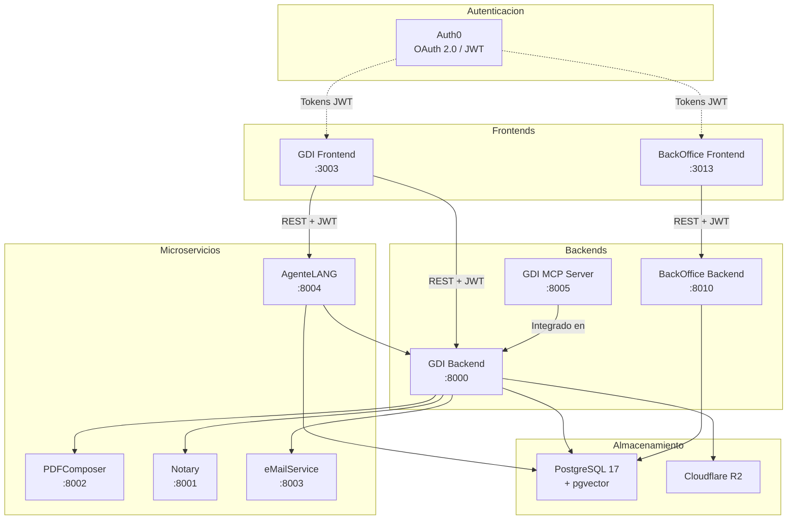

# Arquitectura de la Solucion GDI

## Vista General

GDI esta construido como un sistema distribuido de microservicios, con frontends desacoplados que se comunican con backends especializados a traves de APIs REST. La autenticacion se gestiona via Auth0 (OAuth 2.0 / JWT) y el almacenamiento de archivos utiliza Cloudflare R2 (S3-compatible).

---

## Capa de Frontends

### GDI Frontend (`:3003`)

Aplicacion principal para usuarios del sistema (empleados y funcionarios).

| Aspecto | Detalle |
|---------|---------|
| **Framework** | Next.js 15 (App Router) |
| **UI** | React 18, TypeScript, Tailwind CSS, shadcn/ui |
| **Autenticacion** | Auth0 SDK, JWT |
| **Funcionalidades** | Documentos, Expedientes, Notas, Chat IA |

### BackOffice Frontend (`:3013`)

Panel de administracion para configurar el sistema.

| Aspecto | Detalle |
|---------|---------|
| **Framework** | Next.js 15 (App Router) |
| **UI** | React 18, TypeScript, Tailwind CSS |
| **Autenticacion** | Auth0 SDK, JWT |
| **Funcionalidades** | Organigrama, Tipos de Documento/Expediente, Roles, API Keys |

---

## Capa de Backends

### GDI Backend (`:8000`)

Backend principal que contiene toda la logica de negocio del sistema.

| Aspecto | Detalle |
|---------|---------|
| **Framework** | FastAPI |
| **ORM** | SQLAlchemy (async) |
| **Validacion** | Pydantic v2 |
| **Autenticacion** | Auth0 JWT |
| **Base de datos** | PostgreSQL 17 + pgvector |
| **Almacenamiento** | Cloudflare R2 (S3 API) |

Responsabilidades: gestion de documentos, expedientes, notas, firma digital (orquestacion), numeracion, permisos, movimientos de expedientes.

### BackOffice Backend (`:8010`)

Backend dedicado a las operaciones de administracion.

| Aspecto | Detalle |
|---------|---------|
| **Framework** | FastAPI |
| **DB Driver** | psycopg2 |
| **Autenticacion** | Auth0 JWT |

Responsabilidades: CRUD de organigrama, tipos de documento/expediente, roles, permisos, API keys.

### GDI MCP Server (`:8005`)

Servidor que implementa el protocolo MCP (Model Context Protocol) para permitir que IAs externas (Claude, ChatGPT, Gemini) interactuen con el sistema.

| Aspecto | Detalle |
|---------|---------|
| **Integracion** | Modulo dentro de GDI Backend (`api_gateway/`) |
| **Protocolo** | MCP + OAuth 2.0 |
| **Funcionalidades** | Consulta de documentos, expedientes, notas, usuarios |

---

## Capa de Microservicios

Todos los microservicios son **stateless** (excepto AgenteLANG) y se comunican con los backends via REST con API Keys.

### GDI PDFComposer (`:8002`)

Genera documentos PDF a partir de plantillas HTML.

| Aspecto | Detalle |
|---------|---------|
| **Framework** | FastAPI |
| **Motor PDF** | Gotenberg (HTML a PDF) |
| **Templates** | Jinja2 |

### GDI Notary (`:8001`)

Aplica firma digital PAdES a documentos PDF.

| Aspecto | Detalle |
|---------|---------|
| **Framework** | FastAPI |
| **Firma** | pyHanko (PAdES) |
| **Manipulacion PDF** | PyMuPDF |

### GDI eMailService (`:8003`)

Envia correos electronicos transaccionales.

| Aspecto | Detalle |
|---------|---------|
| **Framework** | FastAPI |
| **Templates** | Jinja2 |
| **Envio** | SMTP |

### GDI AgenteLANG (`:8004`)

Agente de inteligencia artificial con capacidades RAG (Retrieval-Augmented Generation).

| Aspecto | Detalle |
|---------|---------|
| **Framework** | FastAPI |
| **Orquestacion IA** | LangGraph |
| **Modelos** | OpenRouter (multi-proveedor) |
| **Busqueda semantica** | pgvector |
| **Estado** | Stateful (mantiene contexto de conversacion) |

Funcionalidades: asistencia de redaccion, busqueda semantica en expedientes y documentos, consulta de informacion del sistema.

---

## Capa de Almacenamiento

### PostgreSQL 17 + pgvector

Base de datos relacional principal del sistema.

- **Multi-tenant**: cada organizacion opera en un schema separado (ej: `100_test`, `200_municipio`)
- **pgvector**: extension para almacenar y consultar embeddings vectoriales, habilitando busqueda semantica en el agente IA
- **Schemas compartidos**: configuracion global y datos de sistema

### Cloudflare R2

Almacenamiento de objetos S3-compatible para archivos PDF.

- Documentos generados y firmados
- Caratulas de expedientes
- Archivos adjuntos

---

## Capa de Infraestructura

### Railway (PaaS)

Todos los servicios se despliegan en Railway con auto-deploy desde GitHub.

- Cada repositorio es un servicio independiente en Railway
- Comunicacion interna entre servicios via URLs internas de Railway
- Variables de entorno gestionadas por servicio

### Auth0

Proveedor de identidad y autenticacion.

- OAuth 2.0 con tokens JWT
- Gestion de usuarios y roles
- Single Sign-On (SSO) entre Frontend y BackOffice

---

## Flujos Principales

| Flujo | Servicios Involucrados |
|-------|----------------------|
| Crear documento + firmar | Frontend > Backend > PDFComposer > Notary > R2 |
| Crear expediente + caratula | Frontend > Backend > PDFComposer > Notary |
| Asignar/transferir expediente | Frontend > Backend (> PDFComposer > Notary) |
| Chat IA con tools | Frontend > AgenteLANG > Backend |
| Busqueda semantica (RAG) | AgenteLANG > pgvector |
| MCP (IA externa) | Claude/ChatGPT/Gemini > Backend api_gateway/ |
| Notas internas | Frontend > Backend |
| Administracion | BackOffice Frontend > BackOffice Backend |

---

## Integraciones entre Servicios

| Origen | Destino | Protocolo |
|--------|---------|-----------|
| Frontend | Backend | REST + Auth0 JWT |
| BackOffice Frontend | BackOffice Backend | REST + Auth0 JWT |
| Backend | PDFComposer | REST + API Key |
| Backend | Notary | REST + API Key |
| Backend | R2 | S3 API |
| AgenteLANG | Backend | REST + JWT |
| MCP Clients | Backend api_gateway/ | MCP + OAuth 2.0 |
| Backend | eMailService | REST + API Key |

---

## Principios de Arquitectura

- **Frontend solo UI**: los frontends no contienen logica de negocio. Toda la logica reside en los backends.
- **Backends como orquestadores**: los backends coordinan las llamadas a microservicios y gestionan la persistencia.
- **Microservicios stateless**: cada microservicio cumple una funcion especifica y no mantiene estado (excepto AgenteLANG).
- **Multi-tenant por schema**: el aislamiento de datos entre organizaciones se logra con schemas separados en PostgreSQL.
- **Comunicacion interna**: los servicios se comunican via URLs internas de Railway, sin exposicion publica.
- **Autenticacion centralizada**: Auth0 gestiona la identidad. Los backends validan tokens JWT en cada request.
