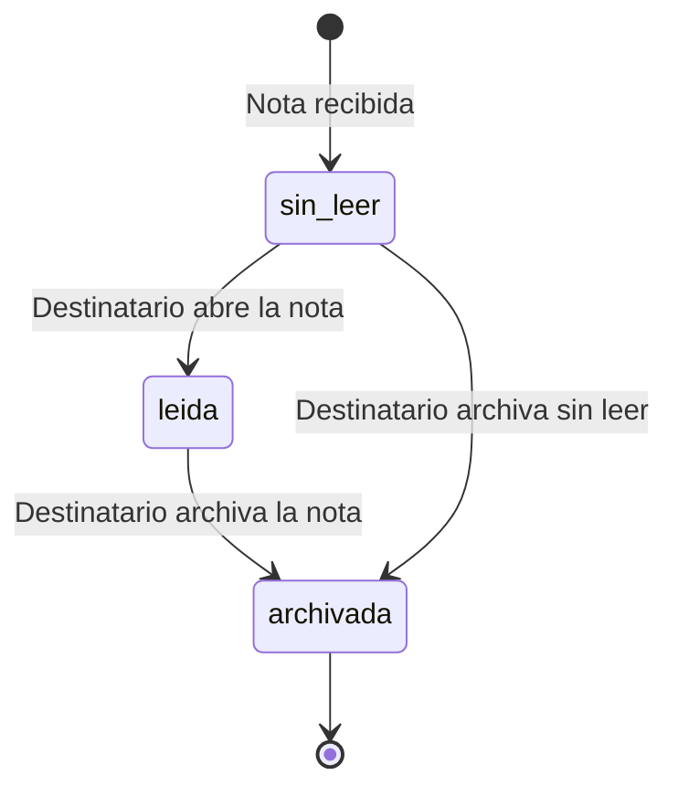
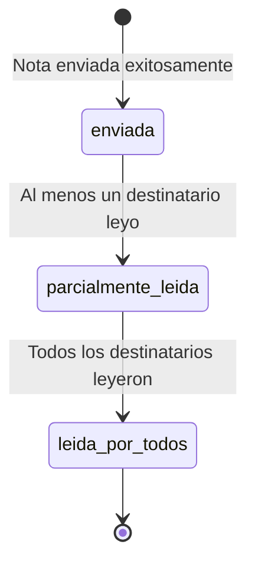

# Estados y Acciones de Notas

## Ciclo de Vida de una Nota

Una nota en GDI tiene un ciclo de vida claro desde su creacion hasta su archivo. A diferencia de los documentos oficiales, las notas no pasan por un circuito de firmas ni numeracion, sino que su ciclo se centra en el **envio, recepcion, lectura y archivo**.

### Vista del Emisor vs. Vista del Destinatario

El estado de una nota se percibe de forma distinta segun el rol del usuario:

| Perspectiva | Estados visibles |
|-------------|-----------------|
| **Emisor** | Enviada, Leida por destinatario(s) |
| **Destinatario** | Sin leer, Leida, Archivada |

---

## Diagrama de Estados

### Desde la Perspectiva del Destinatario



### Desde la Perspectiva del Emisor



---

## Estados del Destinatario

### Sin Leer (`read_at IS NULL`)

La nota fue recibida por el sector pero ningun usuario del sector la ha abierto.

| Propiedad | Valor |
|-----------|-------|
| **Indicador visual** | Resaltado / badge de "sin leer" |
| **Campo en BD** | `note_recipients.read_at IS NULL` |
| **Bandeja** | Entrada |

**Acciones disponibles:**

| Accion | Descripcion | Efecto |
|--------|-------------|--------|
| **Abrir** | Ver el detalle completo de la nota | Cambia estado a "leida", registra `read_at` |
| **Archivar** | Mover a archivados sin leer | Registra `archived_at`, permanece sin `read_at` |

### Leida (`read_at IS NOT NULL`)

Un usuario del sector destinatario abrio la nota y visualizo su contenido.

| Propiedad | Valor |
|-----------|-------|
| **Indicador visual** | Sin resaltado |
| **Campo en BD** | `note_recipients.read_at = timestamp` |
| **Bandeja** | Entrada |

**Acciones disponibles:**

| Accion | Descripcion | Efecto |
|--------|-------------|--------|
| **Ver detalle** | Consultar nuevamente la nota | Sin cambio de estado |
| **Archivar** | Mover a bandeja de archivados | Registra `archived_at` |

### Archivada (`archived_at IS NOT NULL`)

La nota fue archivada por el destinatario. Sigue siendo accesible pero se retira de la bandeja de entrada principal.

| Propiedad | Valor |
|-----------|-------|
| **Indicador visual** | Icono de archivo |
| **Campo en BD** | `note_recipients.archived_at = timestamp` |
| **Bandeja** | Archivados |

**Acciones disponibles:**

| Accion | Descripcion | Efecto |
|--------|-------------|--------|
| **Ver detalle** | Consultar la nota archivada | Sin cambio de estado |

---

## Bandejas del Sistema

El modulo de Notas organiza las comunicaciones en tres bandejas principales:

### Bandeja de Entrada

Muestra las notas recibidas por el sector del usuario que **no han sido archivadas**.

```
Filtro: recipient_sector_id = sector_usuario AND archived_at IS NULL
Orden: created_at DESC (mas recientes primero)
```

| Informacion visible | Descripcion |
|---------------------|-------------|
| **Asunto** | Titulo de la nota |
| **Emisor** | Nombre del sector y usuario que envio |
| **Fecha** | Fecha y hora de envio |
| **Estado** | Indicador de leida / sin leer |
| **Adjuntos** | Indicador de si tiene documentos adjuntos |

### Bandeja de Enviados

Muestra las notas que el usuario ha enviado, con informacion de lectura por cada destinatario.

```
Filtro: sender_user_id = usuario_actual
Orden: created_at DESC
```

| Informacion visible | Descripcion |
|---------------------|-------------|
| **Asunto** | Titulo de la nota |
| **Destinatarios** | Sectores a los que se envio |
| **Fecha** | Fecha y hora de envio |
| **Estado de lectura** | Cuantos destinatarios han leido la nota |
| **Adjuntos** | Indicador de documentos adjuntos |

### Bandeja de Archivados

Muestra las notas que el usuario ha archivado para referencia futura.

```
Filtro: recipient_sector_id = sector_usuario AND archived_at IS NOT NULL
Orden: archived_at DESC
```

| Informacion visible | Descripcion |
|---------------------|-------------|
| **Asunto** | Titulo de la nota |
| **Emisor** | Nombre del sector y usuario que envio |
| **Fecha de envio** | Fecha original de la nota |
| **Fecha de archivo** | Fecha en que se archivo |

---

## Resumen de Acciones por Estado

| Estado | Abrir | Archivar | Ver Detalle |
|--------|:-----:|:--------:|:-----------:|
| **Sin leer** | Si | Si | - |
| **Leida** | - | Si | Si |
| **Archivada** | - | - | Si |

!!! note "Acciones irreversibles"
    El archivo de una nota es una accion de organizacion personal del destinatario. Una vez archivada, la nota permanece en la bandeja de archivados. La accion de lectura es automatica e irreversible: una vez que se registra el `read_at`, no se puede revertir.

!!! tip "Visibilidad del emisor"
    El emisor siempre puede ver el estado de lectura de cada destinatario desde la bandeja de enviados, lo que permite hacer seguimiento de la comunicacion sin necesidad de confirmaciones adicionales.

---

## Tabla Resumen de Transiciones

| Estado Origen | Accion | Estado Destino | Campo Afectado |
|---------------|--------|----------------|----------------|
| Sin leer | Abrir nota | Leida | `read_at = NOW()` |
| Sin leer | Archivar | Archivada (sin leer) | `archived_at = NOW()` |
| Leida | Archivar | Archivada | `archived_at = NOW()` |
