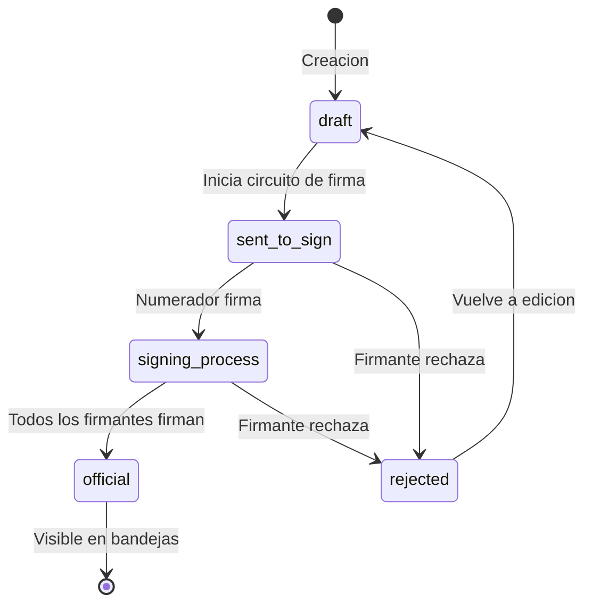
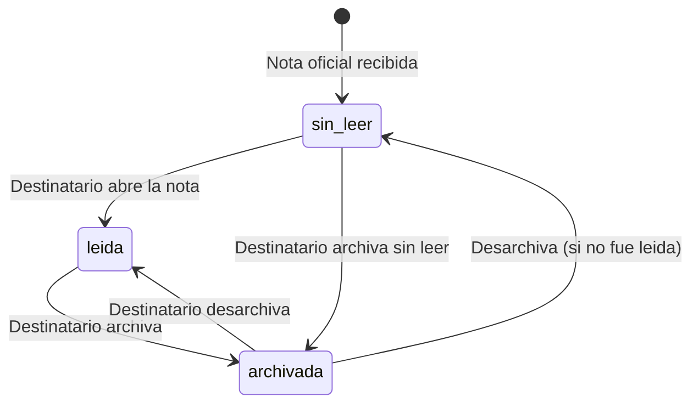
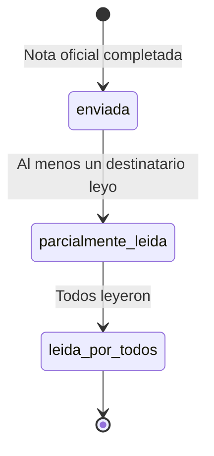

# Estados y Acciones de Notas

## Ciclo de Vida de una Nota

Una Nota en GDI tiene un doble ciclo de vida: como **documento oficial** (draft → firma → official) y como **comunicacion** (recepcion → lectura → archivo). El primer ciclo sigue las mismas reglas que cualquier documento del sistema. El segundo es propio del modulo de Notas.

### Ciclo de Vida como Documento

La Nota pasa por los mismos estados que cualquier documento oficial:



| Estado | Descripcion |
|--------|-------------|
| `draft` | Borrador en edicion. Se definen destinatarios, contenido y firmantes |
| `sent_to_sign` | Enviada al circuito de firma. Pendiente de numerador |
| `signing_process` | Numerador firmo, pendiente de firmantes restantes |
| `official` | Todos firmaron. Numero oficial asignado. Visible para destinatarios |
| `rejected` | Un firmante rechazo con observaciones. Vuelve a draft |

### Ciclo de Vida como Comunicacion

Una vez que la Nota es `official`, inicia su ciclo como comunicacion:

#### Perspectiva del Destinatario



#### Perspectiva del Emisor



---

## Estados del Destinatario

### Sin Leer (sin registro en `notes_openings`)

La nota oficial fue recibida por el sector pero ningun usuario la ha abierto.

| Propiedad | Valor |
|-----------|-------|
| **Indicador visual** | Resaltado / badge de "sin leer" |
| **Condicion en BD** | No existe registro en `notes_openings` para este usuario/documento |
| **Bandeja** | Entrada |

**Acciones disponibles:**

| Accion | Descripcion | Efecto |
|--------|-------------|--------|
| **Abrir** | Ver el detalle de la nota | Registra apertura en `notes_openings` |
| **Archivar** | Mover a archivados | `is_archived = true`, `archived_at = NOW()` |

### Leida (existe registro en `notes_openings`)

Un usuario del sector abrio la nota y visualizo su contenido.

| Propiedad | Valor |
|-----------|-------|
| **Indicador visual** | Sin resaltado |
| **Condicion en BD** | Existe registro en `notes_openings` con `opened_at` |
| **Bandeja** | Entrada |

**Acciones disponibles:**

| Accion | Descripcion | Efecto |
|--------|-------------|--------|
| **Ver detalle** | Consultar nuevamente la nota | Sin cambio de estado |
| **Archivar** | Mover a bandeja de archivados | `is_archived = true`, `archived_at = NOW()` |

### Archivada (`is_archived = true`)

La nota fue archivada por el destinatario. Sigue accesible desde la bandeja de archivados.

| Propiedad | Valor |
|-----------|-------|
| **Indicador visual** | Icono de archivo |
| **Condicion en BD** | `notes_recipients.is_archived = true` |
| **Bandeja** | Archivados |

**Acciones disponibles:**

| Accion | Descripcion | Efecto |
|--------|-------------|--------|
| **Ver detalle** | Consultar la nota archivada | Sin cambio de estado |
| **Desarchivar** | Volver a bandeja de entrada | `is_archived = false`, `archived_at = NULL` |

---

## Bandejas del Sistema

El modulo de Notas organiza las comunicaciones en tres bandejas principales:

### Bandeja de Entrada

Muestra las notas oficiales recibidas por los sectores del usuario que **no han sido archivadas**.

```sql
SELECT od.*, nr.recipient_type, nr.is_archived
FROM official_documents od
JOIN notes_recipients nr ON nr.document_id = od.id
WHERE nr.sector_id = ANY(:user_sector_ids::uuid[])
  AND nr.is_archived = false
ORDER BY od.signed_at DESC;
```

| Informacion visible | Descripcion |
|---------------------|-------------|
| **Numero oficial** | Numero de la nota (ej: NOTA-2026-000123-TN-LEGAL) |
| **Asunto** | Referencia/titulo de la nota |
| **Emisor** | Sector y departamento que envio |
| **Fecha** | Fecha de firma/oficializacion |
| **Estado** | Indicador de leida / sin leer |
| **Tipo recipient** | TO o CC (BCC no visible) |

### Bandeja de Enviados

Muestra las notas oficiales que el usuario ha firmado/enviado, con informacion de lectura.

| Informacion visible | Descripcion |
|---------------------|-------------|
| **Numero oficial** | Numero de la nota |
| **Asunto** | Referencia de la nota |
| **Destinatarios** | Sectores TO/CC/BCC |
| **Fecha** | Fecha de firma |
| **Aperturas** | Cantidad de destinatarios que abrieron la nota |

### Bandeja de Archivados

Muestra las notas que el usuario ha archivado.

| Informacion visible | Descripcion |
|---------------------|-------------|
| **Numero oficial** | Numero de la nota |
| **Asunto** | Referencia |
| **Emisor** | Sector emisor |
| **Fecha de archivo** | Cuando se archivo |

---

## Resumen de Acciones por Estado

### Como Documento

| Estado | Editar | Firmar | Rechazar | Visible en bandejas |
|--------|:------:|:------:|:--------:|:-------------------:|
| **draft** | Si | No | No | No |
| **sent_to_sign** | No | Si (numerador) | Si | No |
| **signing_process** | No | Si (firmantes) | Si | No |
| **official** | No | No | No | Si |
| **rejected** | Si | No | No | No |

### Como Comunicacion (solo estado `official`)

| Estado | Abrir | Archivar | Desarchivar | Ver Detalle |
|--------|:-----:|:--------:|:-----------:|:-----------:|
| **Sin leer** | Si | Si | - | - |
| **Leida** | - | Si | - | Si |
| **Archivada** | - | - | Si | Si |

!!! note "Lectura irreversible"
    La apertura de una nota es automatica e irreversible: una vez registrada en `notes_openings`, no se puede revertir. El archivado si es reversible (se puede desarchivar).

!!! tip "Visibilidad del emisor"
    El emisor siempre puede ver las aperturas (quien, cuando) desde el detalle de la nota, lo que permite hacer seguimiento sin confirmaciones adicionales.

---

## Tabla Resumen de Transiciones

### Documento

| Estado Origen | Accion | Estado Destino |
|---------------|--------|----------------|
| draft | Iniciar firma | sent_to_sign |
| sent_to_sign | Numerador firma | signing_process |
| signing_process | Ultimo firmante firma | official |
| sent_to_sign/signing_process | Firmante rechaza | rejected |
| rejected | Editar y reenviar | draft |

### Comunicacion

| Estado Origen | Accion | Estado Destino | Campo Afectado |
|---------------|--------|----------------|----------------|
| Sin leer | Abrir nota | Leida | `INSERT notes_openings` |
| Sin leer | Archivar | Archivada (sin leer) | `is_archived = true, archived_at = NOW()` |
| Leida | Archivar | Archivada | `is_archived = true, archived_at = NOW()` |
| Archivada | Desarchivar | Leida/Sin leer | `is_archived = false, archived_at = NULL` |
