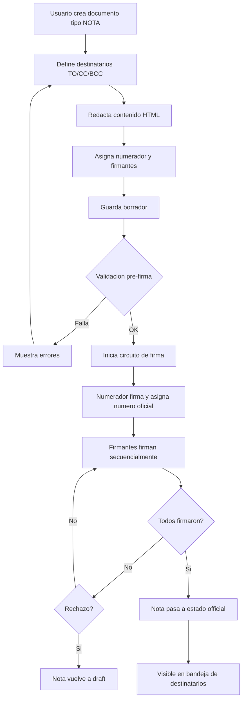
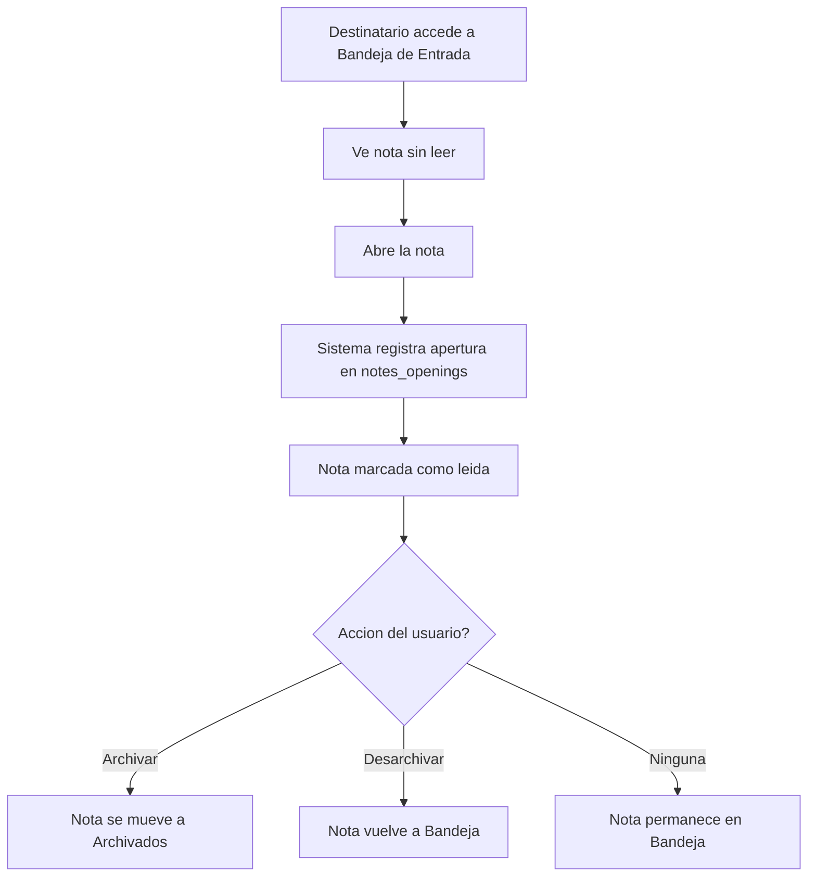
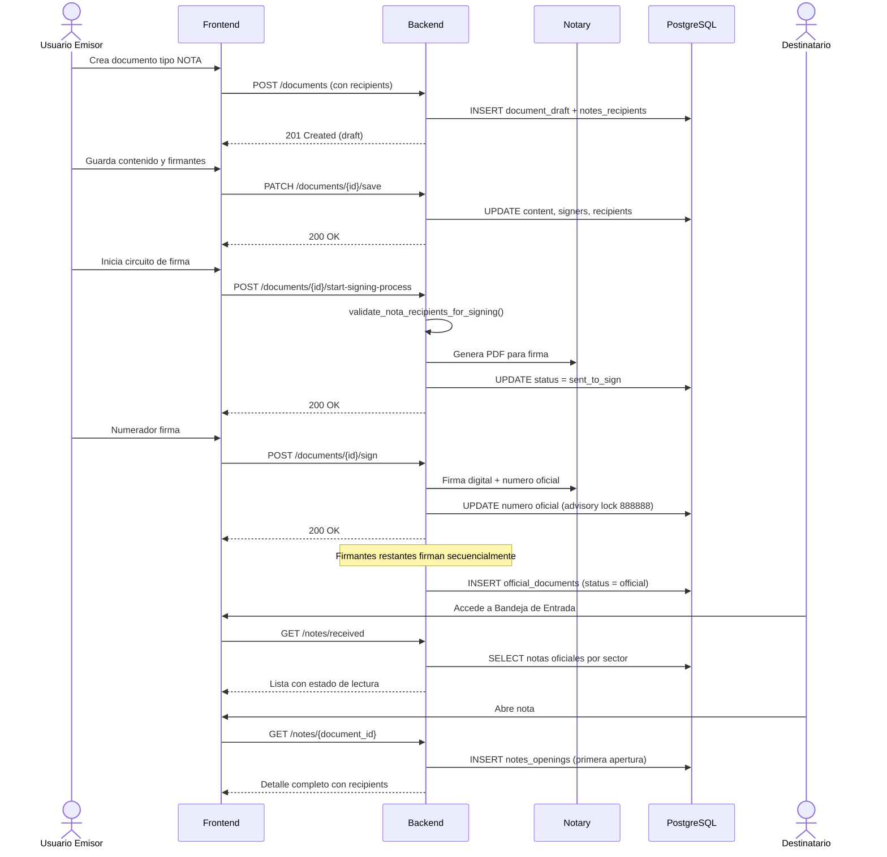

# Flujo de Creacion, Firma y Envio de Notas

Una Nota en GDI es un documento oficial que pasa por el circuito completo de firma digital antes de ser visible para los destinatarios. El flujo combina la creacion de documentos con el sistema de destinatarios propio de las Notas.

## Diagrama General del Flujo



---

## Pasos Detallados

### Paso 1: Crear Documento tipo NOTA

El usuario crea un nuevo documento seleccionando el tipo **NOTA** desde el catalogo de tipos de documento. Esto se hace a traves del endpoint estandar de creacion de documentos.

```
POST /documents/
{
  "document_type_id": <ID del tipo NOTA>,
  "reference": "Asunto de la nota",
  "recipients": {
    "to": ["uuid-sector-destino-1"],
    "cc": ["uuid-sector-copia"],
    "bcc": ["uuid-sector-oculto"]
  },
  "sender_sector_id": "uuid-mi-sector"
}
```

### Paso 2: Definir Destinatarios

Los destinatarios se definen al momento de crear o guardar la nota:

| Tipo | Obligatorio | Descripcion |
|------|:-----------:|-------------|
| **TO** | Si | Destinatarios principales. Al menos uno requerido |
| **CC** | No | Copia. Visible para todos los destinatarios |
| **BCC** | No | Copia oculta. Solo visible para el emisor |

!!! tip "Validaciones de destinatarios"
    - Al menos 1 destinatario TO es obligatorio
    - El sector emisor no puede ser destinatario
    - Si un sector aparece en TO, se elimina automaticamente de CC/BCC
    - Todos los sectores deben existir y estar activos

### Paso 3: Redactar Contenido

El contenido se redacta en el editor HTML (Quill), igual que cualquier otro documento:

- **Asunto** (`reference`): titulo breve de la comunicacion
- **Cuerpo** (`content.html`): contenido completo en HTML

### Paso 4: Asignar Firmantes

Como documento oficial, la nota requiere:

- **Numerador**: primer firmante, asigna el numero oficial al firmar
- **Firmantes**: uno o mas firmantes adicionales en orden secuencial

### Paso 5: Guardar Borrador

```
PATCH /documents/{id}/save
{
  "content": "<h1>Contenido</h1><p>...</p>",
  "signers": [...],
  "recipients": { "to": [...], "cc": [...], "bcc": [...] }
}
```

Al guardar, el sistema actualiza contenido, firmantes y destinatarios. Los recipients anteriores se reemplazan completamente.

### Paso 6: Validacion Pre-Firma

Antes de iniciar el circuito de firma, el sistema valida:

| Validacion | Regla |
|------------|-------|
| **Destinatarios TO** | Al menos un sector TO definido |
| **Sectores activos** | Todos los sectores destinatarios deben estar activos |
| **Numerador** | Debe tener numerador asignado |
| **Firmantes** | Al menos un firmante ademas del numerador |
| **Contenido** | Debe tener contenido no vacio |

Si la validacion falla, se lanza `ValidationError` y la nota no puede enviarse a firma.

### Paso 7: Circuito de Firma

```
POST /documents/{id}/start-signing-process
```

Al iniciar el circuito:

1. El documento cambia a estado `sent_to_sign`
2. GDI-Notary genera el PDF para firma
3. El numerador recibe la nota para firmar primero
4. Al firmar el numerador, se asigna el numero oficial (advisory lock 888888 + global_sequence)
5. Los firmantes restantes firman en orden secuencial
6. Al completarse todas las firmas, la nota pasa a `official`

### Paso 8: Nota Oficial

Una vez oficial:

- Se crea registro en `official_documents`
- La nota aparece en `GET /notes/received` de los sectores destinatarios
- La nota aparece en `GET /notes/sent` del emisor
- Los destinatarios la ven como "sin leer" hasta que la abran

---

## Flujo de Recepcion y Lectura



### Apertura de Nota

1. El destinatario ve la nota en su bandeja con indicador "sin leer"
2. Al abrir (`GET /notes/{id}`), el sistema registra automaticamente la apertura en `notes_openings`
3. El registro es **idempotente**: solo se registra la primera apertura por usuario
4. El emisor puede ver las aperturas (quien, cuando) desde el detalle de la nota

### Archivo de Nota

1. El destinatario archiva la nota (`PATCH /notes/{id}/archive`)
2. Se actualiza `is_archived = true` y `archived_at = NOW()` en `notes_recipients`
3. La nota desaparece de la bandeja de entrada y aparece en archivados
4. Puede desarchivarse para volver a la bandeja de entrada

---

## Diagrama de Secuencia Completo



---

## Consideraciones Tecnicas

!!! note "Transaccionalidad"
    La creacion del documento y sus recipients se ejecuta dentro de una **transaccion unica**. Si falla la insercion de recipients, se revierte la creacion del documento.

!!! tip "Validacion pre-firma"
    La funcion `validate_nota_recipients_for_signing()` se ejecuta antes de enviar a Notary. Verifica que exista al menos un TO y que todos los sectores destinatarios sigan activos. Si falla, la nota no puede enviarse a firma.

!!! warning "Multi-tenant"
    Como todo modulo de GDI, las operaciones de notas respetan el esquema del tenant activo. El parametro `schema_name` es **keyword-only** en todas las funciones de base de datos.
