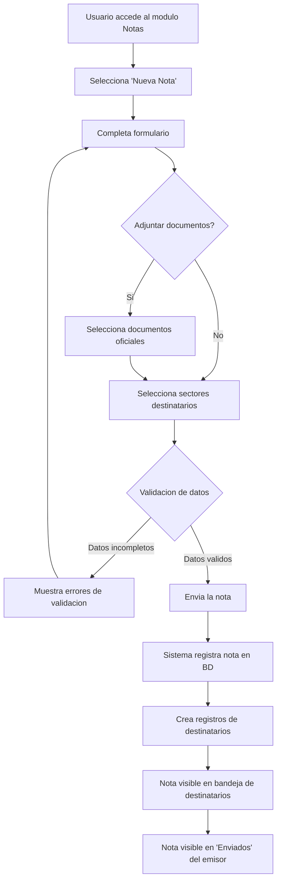
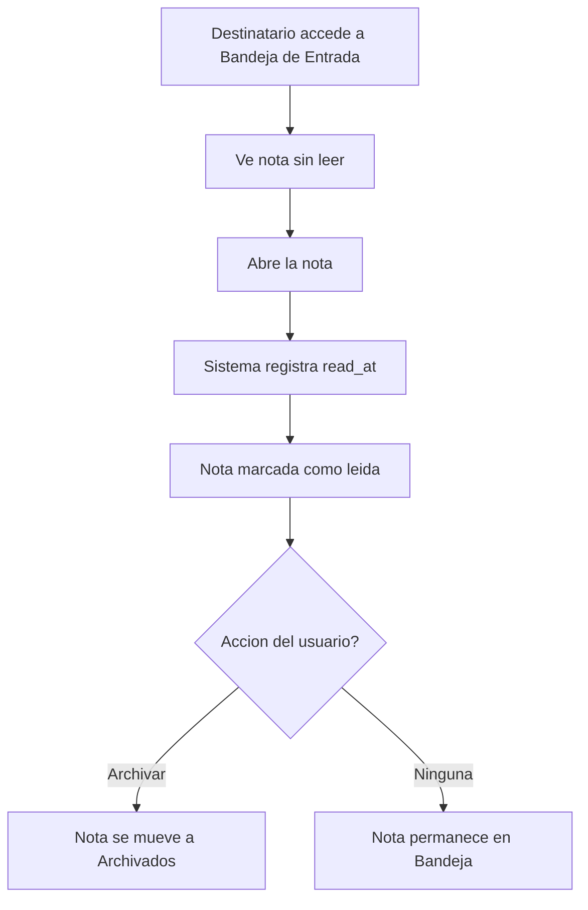
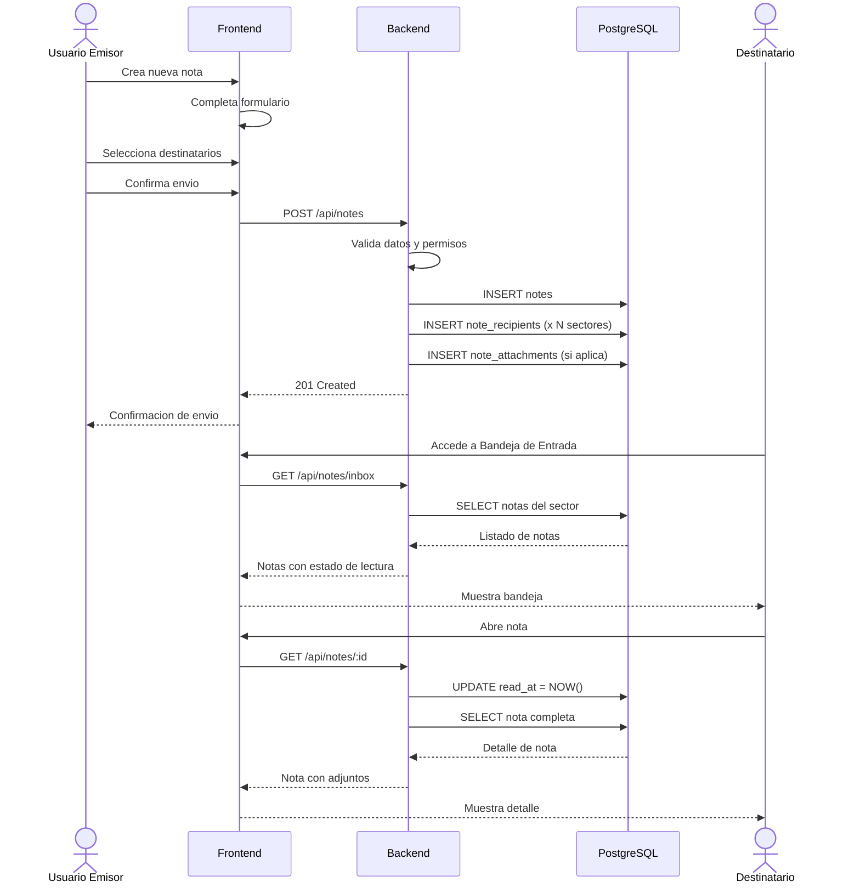

# Flujo de Creacion y Envio de Notas

El proceso de creacion y envio de notas en GDI esta disenado para ser directo y eficiente, permitiendo a los usuarios comunicarse formalmente con otros sectores de la organizacion con trazabilidad completa.

## Diagrama General del Flujo

---

## Pasos Detallados

### Paso 1: Acceso al Modulo

El usuario accede al modulo de Notas desde el menu principal de GDI. Se presenta la bandeja de entrada como vista por defecto.

### Paso 2: Iniciar Nueva Nota

El usuario selecciona la accion "Nueva Nota", que abre el formulario de creacion.

### Paso 3: Completar Formulario

El formulario de creacion requiere los siguientes campos:

| Campo | Tipo | Obligatorio | Descripcion |
|-------|------|-------------|-------------|
| **Asunto** | Text Input | Si | Titulo breve de la comunicacion (max 200 caracteres) |
| **Cuerpo** | Textarea | Si | Contenido completo del mensaje |
| **Destinatarios** | Multi-select | Si | Uno o mas sectores destinatarios |
| **Adjuntos** | File selector | No | Documentos oficiales a vincular |

!!! tip "Selector de destinatarios"
    El selector de destinatarios muestra los sectores disponibles segun la estructura organizacional configurada en el sistema. El usuario puede seleccionar multiples sectores en una sola operacion.

### Paso 4: Adjuntar Documentos (Opcional)

Si el usuario necesita acompanar la nota con documentacion oficial:

1. Selecciona la opcion de adjuntar documentos
2. El sistema muestra documentos oficiales disponibles
3. El usuario selecciona uno o mas documentos
4. Los documentos quedan vinculados a la nota

!!! warning "Solo documentos oficiales"
    Las notas solo permiten adjuntar documentos que ya existen en el sistema GDI. No se permite la carga de archivos externos directamente en la nota.

### Paso 5: Seleccion de Destinatarios

El usuario selecciona los sectores que recibiran la nota:

- Se muestra un listado de sectores de la organizacion
- Permite seleccion multiple
- Al menos un destinatario es obligatorio

### Paso 6: Validacion

Antes del envio, el sistema valida:

| Validacion | Regla |
|------------|-------|
| **Asunto** | No puede estar vacio |
| **Cuerpo** | No puede estar vacio |
| **Destinatarios** | Al menos un sector seleccionado |
| **Permisos** | Usuario debe pertenecer a un sector activo |

Si alguna validacion falla, se muestran mensajes de error y el usuario puede corregir los datos.

### Paso 7: Envio

Al confirmar el envio:

1. **Registro de la nota**: Se crea el registro principal en la tabla `notes` con los datos del emisor
2. **Registro de destinatarios**: Se crea un registro en `note_recipients` por cada sector destinatario
3. **Registro de adjuntos**: Si hay documentos adjuntos, se crean los registros en `note_attachments`
4. **Confirmacion**: El sistema confirma el envio exitoso al usuario

### Paso 8: Resultado

- La nota aparece en la **bandeja de enviados** del emisor
- La nota aparece en la **bandeja de entrada** de cada sector destinatario
- Los destinatarios ven la nota como **sin leer** hasta que la abran

---

## Flujo de Recepcion y Lectura

### Lectura de Nota

1. El destinatario ve la nota en su bandeja de entrada con indicador de "sin leer"
2. Al abrir la nota, el sistema registra automaticamente el timestamp de lectura (`read_at`)
3. La nota cambia su indicador visual a "leida"
4. El emisor puede ver en su bandeja de enviados que el destinatario leyo la nota

### Archivo de Nota

1. El destinatario puede archivar una nota desde la bandeja de entrada
2. Se registra el timestamp de archivo (`archived_at`)
3. La nota se mueve a la bandeja de archivados
4. La nota sigue siendo accesible desde la bandeja de archivados para consulta futura

---

## Diagrama de Secuencia Completo

---

## Consideraciones Tecnicas

!!! note "Transaccionalidad"
    La creacion de una nota (registro principal + destinatarios + adjuntos) se ejecuta dentro de una **transaccion unica** para garantizar consistencia. Si falla alguna parte, se revierte todo el proceso.

!!! tip "Performance"
    Las consultas de bandeja estan optimizadas con indices sobre `recipient_sector_id`, `read_at` y `archived_at` para garantizar tiempos de respuesta rapidos incluso con alto volumen de notas.

!!! warning "Multi-tenant"
    Como todo modulo de GDI, las operaciones de notas respetan el esquema del tenant activo. El parametro `schema_name` es **keyword-only** en todas las funciones de base de datos.
