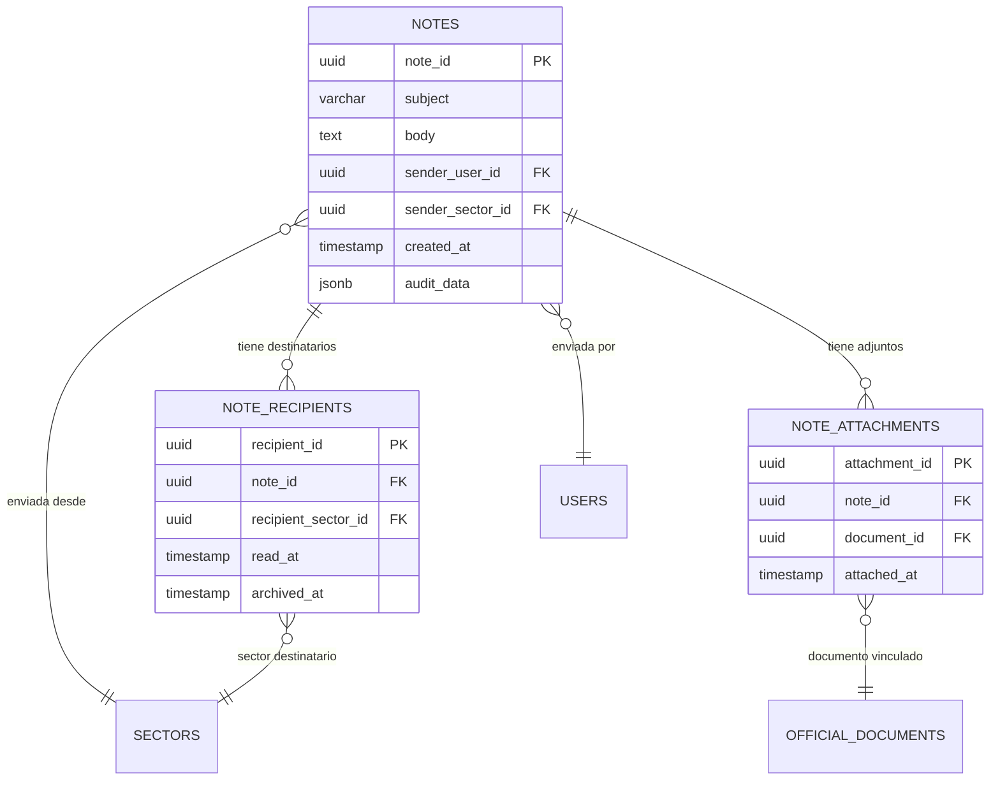
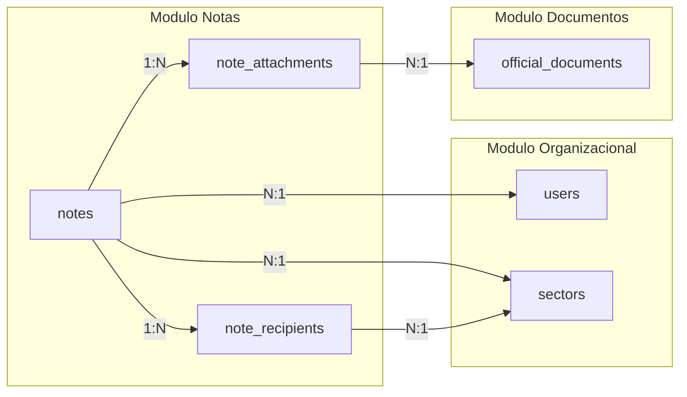

# Modelo de Datos - Modulo Notas

## Conceptos Fundamentales

El modelo de datos del modulo de Notas esta disenado para soportar comunicaciones oficiales entre sectores con trazabilidad completa. La estructura se compone de tres tablas principales que manejan la nota en si, sus destinatarios y los documentos adjuntos.

### Diagrama Entidad-Relacion



---

## Estructura de Datos Implementada

### Tabla Principal: `notes`

**Proposito**: Registro central de cada nota con sus metadatos de envio.

```sql
CREATE TABLE notes (
    -- Identificacion unica
    note_id UUID DEFAULT gen_random_uuid() PRIMARY KEY,

    -- Contenido de la nota
    subject VARCHAR(200) NOT NULL CHECK (length(trim(subject)) > 0),
    body TEXT NOT NULL CHECK (length(trim(body)) > 0),

    -- Datos del emisor
    sender_user_id UUID NOT NULL,
    sender_sector_id UUID NOT NULL,

    -- Auditoria temporal
    created_at TIMESTAMP WITHOUT TIME ZONE DEFAULT NOW(),

    -- Metadatos adicionales
    audit_data JSONB,

    -- Constraints
    CONSTRAINT fk_sender_user FOREIGN KEY (sender_user_id)
        REFERENCES users(user_id),
    CONSTRAINT fk_sender_sector FOREIGN KEY (sender_sector_id)
        REFERENCES sectors(sector_id)
);
```

**Campos principales:**

| Campo | Tipo | Descripcion |
|-------|------|-------------|
| `note_id` | UUID | Identificador unico de la nota |
| `subject` | VARCHAR(200) | Asunto de la nota, obligatorio |
| `body` | TEXT | Cuerpo completo del mensaje, obligatorio |
| `sender_user_id` | UUID | Usuario que creo y envio la nota |
| `sender_sector_id` | UUID | Sector desde el cual se envio la nota |
| `created_at` | TIMESTAMP | Fecha y hora de creacion/envio |
| `audit_data` | JSONB | Metadatos de auditoria adicionales |

!!! note "Inmutabilidad"
    Una vez enviada, la nota no puede ser modificada ni eliminada. El contenido (`subject` y `body`) queda registrado de forma permanente para garantizar la integridad de la comunicacion.

---

### Tabla de Destinatarios: `note_recipients`

**Proposito**: Registrar cada sector destinatario y el estado de lectura/archivo individual.

```sql
CREATE TABLE note_recipients (
    -- Identificacion unica
    recipient_id UUID DEFAULT gen_random_uuid() PRIMARY KEY,

    -- Vinculacion con la nota
    note_id UUID NOT NULL,

    -- Sector destinatario
    recipient_sector_id UUID NOT NULL,

    -- Estado de la nota para este destinatario
    read_at TIMESTAMP WITHOUT TIME ZONE,     -- NULL = sin leer
    archived_at TIMESTAMP WITHOUT TIME ZONE, -- NULL = no archivada

    -- Constraints
    CONSTRAINT fk_recipient_note FOREIGN KEY (note_id)
        REFERENCES notes(note_id),
    CONSTRAINT fk_recipient_sector FOREIGN KEY (recipient_sector_id)
        REFERENCES sectors(sector_id),
    CONSTRAINT unique_note_recipient UNIQUE (note_id, recipient_sector_id)
);
```

**Campos principales:**

| Campo | Tipo | Descripcion |
|-------|------|-------------|
| `recipient_id` | UUID | Identificador unico del registro de destinatario |
| `note_id` | UUID | Referencia a la nota |
| `recipient_sector_id` | UUID | Sector que recibe la nota |
| `read_at` | TIMESTAMP | Timestamp de primera lectura. `NULL` = sin leer |
| `archived_at` | TIMESTAMP | Timestamp de archivo. `NULL` = no archivada |

!!! tip "Logica de estados"
    El estado de una nota para un destinatario se determina por los valores de `read_at` y `archived_at`:

    - **Sin leer**: `read_at IS NULL AND archived_at IS NULL`
    - **Leida**: `read_at IS NOT NULL AND archived_at IS NULL`
    - **Archivada**: `archived_at IS NOT NULL`

---

### Tabla de Adjuntos: `note_attachments`

**Proposito**: Vincular documentos oficiales del sistema a una nota.

```sql
CREATE TABLE note_attachments (
    -- Identificacion unica
    attachment_id UUID DEFAULT gen_random_uuid() PRIMARY KEY,

    -- Vinculacion con la nota
    note_id UUID NOT NULL,

    -- Vinculacion con el documento oficial
    document_id UUID NOT NULL,

    -- Auditoria
    attached_at TIMESTAMP WITHOUT TIME ZONE DEFAULT NOW(),

    -- Constraints
    CONSTRAINT fk_attachment_note FOREIGN KEY (note_id)
        REFERENCES notes(note_id),
    CONSTRAINT fk_attachment_document FOREIGN KEY (document_id)
        REFERENCES official_documents(official_document_id),
    CONSTRAINT unique_note_document UNIQUE (note_id, document_id)
);
```

**Campos principales:**

| Campo | Tipo | Descripcion |
|-------|------|-------------|
| `attachment_id` | UUID | Identificador unico del adjunto |
| `note_id` | UUID | Referencia a la nota |
| `document_id` | UUID | Referencia al documento oficial vinculado |
| `attached_at` | TIMESTAMP | Fecha y hora de vinculacion |

!!! warning "Solo documentos oficiales"
    Los adjuntos de notas referencian documentos que ya existen en la tabla `official_documents`. No se almacenan archivos directamente en la nota; se vinculan documentos oficiales del sistema.

---

## Relaciones entre Tablas



| Relacion | Tipo | Descripcion |
|----------|------|-------------|
| `notes` -> `note_recipients` | 1:N | Una nota tiene uno o mas destinatarios |
| `notes` -> `note_attachments` | 1:N | Una nota puede tener cero o mas adjuntos |
| `notes` -> `users` | N:1 | Cada nota tiene un unico usuario emisor |
| `notes` -> `sectors` | N:1 | Cada nota se envia desde un unico sector |
| `note_recipients` -> `sectors` | N:1 | Cada registro de destinatario refiere a un sector |
| `note_attachments` -> `official_documents` | N:1 | Cada adjunto refiere a un documento oficial |

---

## Indices para Optimizacion de Performance

```sql
-- Indices principales para consultas de bandeja
CREATE INDEX idx_notes_sender_user ON notes(sender_user_id);
CREATE INDEX idx_notes_sender_sector ON notes(sender_sector_id);
CREATE INDEX idx_notes_created_at ON notes(created_at);

-- Indices para bandeja de entrada (consulta mas frecuente)
CREATE INDEX idx_recipients_sector ON note_recipients(recipient_sector_id);
CREATE INDEX idx_recipients_note ON note_recipients(note_id);
CREATE INDEX idx_recipients_unread ON note_recipients(recipient_sector_id)
    WHERE read_at IS NULL AND archived_at IS NULL;
CREATE INDEX idx_recipients_archived ON note_recipients(recipient_sector_id)
    WHERE archived_at IS NOT NULL;

-- Indices para adjuntos
CREATE INDEX idx_attachments_note ON note_attachments(note_id);
CREATE INDEX idx_attachments_document ON note_attachments(document_id);
```

!!! tip "Indice parcial para sin leer"
    El indice `idx_recipients_unread` es un indice parcial que solo incluye registros sin leer y sin archivar. Esto optimiza significativamente la consulta mas frecuente del sistema: la bandeja de entrada con notas pendientes.

---

## Consultas Comunes

### Bandeja de Entrada (notas sin archivar de un sector)

```sql
SELECT n.note_id, n.subject, n.body, n.created_at,
       u.first_name || ' ' || u.last_name AS sender_name,
       s.name AS sender_sector,
       nr.read_at,
       EXISTS(SELECT 1 FROM note_attachments na WHERE na.note_id = n.note_id) AS has_attachments
FROM note_recipients nr
JOIN notes n ON n.note_id = nr.note_id
JOIN users u ON u.user_id = n.sender_user_id
JOIN sectors s ON s.sector_id = n.sender_sector_id
WHERE nr.recipient_sector_id = :sector_id
  AND nr.archived_at IS NULL
ORDER BY n.created_at DESC;
```

### Bandeja de Enviados (notas enviadas por un usuario)

```sql
SELECT n.note_id, n.subject, n.created_at,
       COUNT(nr.recipient_id) AS total_recipients,
       COUNT(nr.read_at) AS read_count,
       EXISTS(SELECT 1 FROM note_attachments na WHERE na.note_id = n.note_id) AS has_attachments
FROM notes n
JOIN note_recipients nr ON nr.note_id = n.note_id
WHERE n.sender_user_id = :user_id
GROUP BY n.note_id, n.subject, n.created_at
ORDER BY n.created_at DESC;
```

### Marcar como Leida

```sql
UPDATE note_recipients
SET read_at = NOW()
WHERE note_id = :note_id
  AND recipient_sector_id = :sector_id
  AND read_at IS NULL;
```

### Archivar Nota

```sql
UPDATE note_recipients
SET archived_at = NOW()
WHERE note_id = :note_id
  AND recipient_sector_id = :sector_id
  AND archived_at IS NULL;
```
