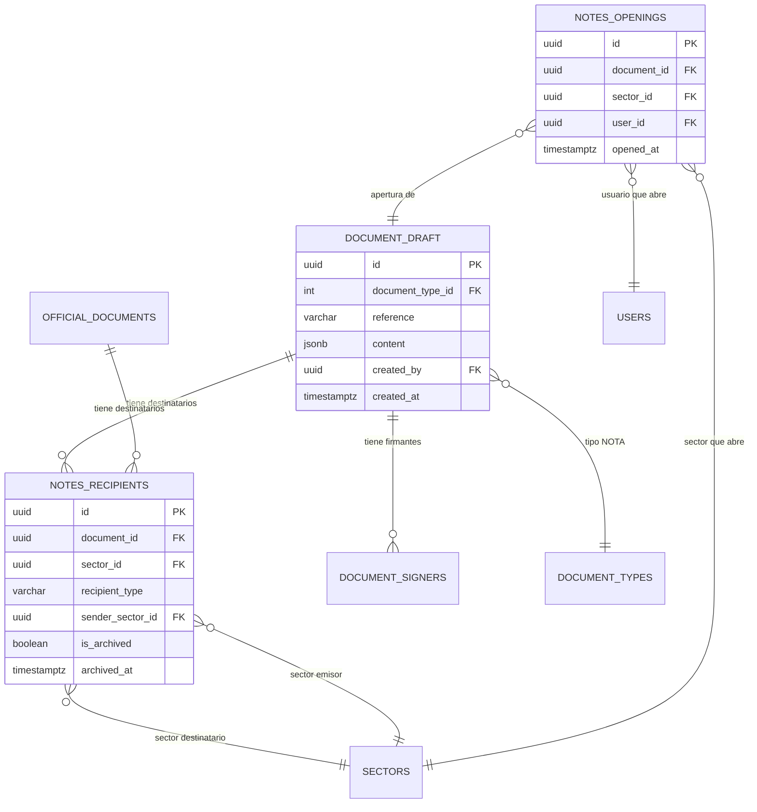
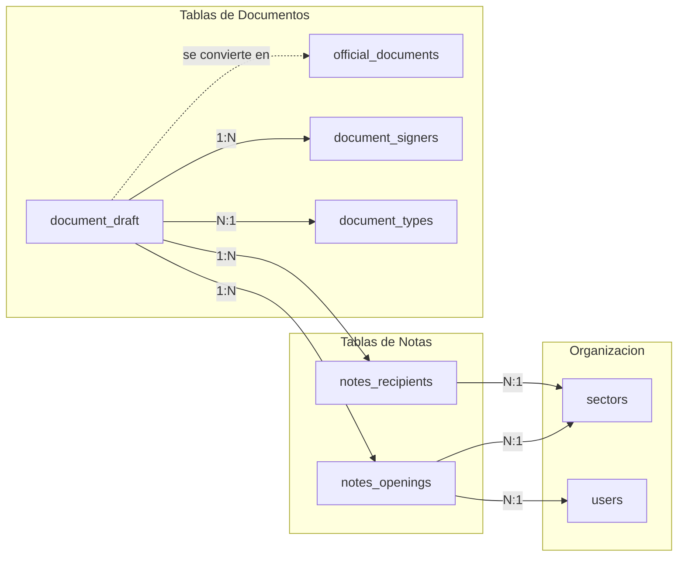

# Modelo de Datos - Modulo Notas

## Conceptos Fundamentales

Las Notas son documentos oficiales de tipo `NOTA` que utilizan las tablas estandar de documentos (`document_draft`, `official_documents`, `document_signers`) mas dos tablas especificas para destinatarios y tracking de lectura.

El tipo `NOTA` esta registrado en `global_document_types` con el enum `document_type_source = 'NOTA'`, lo que permite al sistema identificarlas y aplicar logica especifica (validacion de recipients, visibilidad en bandejas).

### Diagrama Entidad-Relacion



---

## Tablas Especificas de Notas

### Tabla: `notes_recipients`

**Proposito**: Registrar los sectores destinatarios de cada nota y su estado de archivado. Un registro por cada par documento-sector.

```sql
CREATE TABLE notes_recipients (
    id UUID PRIMARY KEY DEFAULT gen_random_uuid(),

    -- Vinculacion con el documento
    document_id UUID NOT NULL,

    -- Sector destinatario
    sector_id UUID NOT NULL,

    -- Tipo de destinatario
    recipient_type VARCHAR(3) NOT NULL CHECK (recipient_type IN ('TO', 'CC', 'BCC')),

    -- Sector que envio la nota
    sender_sector_id UUID NOT NULL,

    -- Estado de archivado
    is_archived BOOLEAN NOT NULL DEFAULT false,
    archived_at TIMESTAMPTZ NULL,

    -- Constraints
    CONSTRAINT fk_notes_recipients_document FOREIGN KEY (document_id)
        REFERENCES document_draft(id),
    CONSTRAINT fk_notes_recipients_sector FOREIGN KEY (sector_id)
        REFERENCES sectors(id),
    CONSTRAINT fk_notes_recipients_sender FOREIGN KEY (sender_sector_id)
        REFERENCES sectors(id),
    CONSTRAINT unique_notes_recipient UNIQUE (document_id, sector_id)
);
```

**Campos principales:**

| Campo | Tipo | Descripcion |
|-------|------|-------------|
| `id` | UUID | Identificador unico del registro |
| `document_id` | UUID | Referencia al documento (FK a `document_draft`) |
| `sector_id` | UUID | Sector destinatario |
| `recipient_type` | VARCHAR(3) | Tipo: `TO`, `CC` o `BCC` |
| `sender_sector_id` | UUID | Sector que envio la nota |
| `is_archived` | BOOLEAN | Si el destinatario archivo la nota |
| `archived_at` | TIMESTAMPTZ | Fecha de archivado (NULL si no archivada) |

!!! note "Unique constraint"
    Un sector solo puede ser destinatario una vez por nota (UNIQUE en document_id + sector_id). Si aparece en multiples tipos (TO y CC), se prioriza TO.

---

### Tabla: `notes_openings`

**Proposito**: Registrar la primera apertura de una nota por cada usuario. Es idempotente: solo se registra una vez por usuario.

```sql
CREATE TABLE notes_openings (
    id UUID PRIMARY KEY DEFAULT gen_random_uuid(),

    -- Vinculacion con el documento
    document_id UUID NOT NULL,

    -- Sector desde el cual se abrio
    sector_id UUID NOT NULL,

    -- Usuario que abrio
    user_id UUID NOT NULL,

    -- Timestamp de apertura
    opened_at TIMESTAMPTZ NOT NULL DEFAULT NOW(),

    -- Constraints
    CONSTRAINT fk_notes_openings_document FOREIGN KEY (document_id)
        REFERENCES document_draft(id),
    CONSTRAINT fk_notes_openings_sector FOREIGN KEY (sector_id)
        REFERENCES sectors(id),
    CONSTRAINT fk_notes_openings_user FOREIGN KEY (user_id)
        REFERENCES users(id),
    CONSTRAINT unique_notes_opening UNIQUE (document_id, user_id)
);
```

**Campos principales:**

| Campo | Tipo | Descripcion |
|-------|------|-------------|
| `id` | UUID | Identificador unico |
| `document_id` | UUID | Referencia al documento |
| `sector_id` | UUID | Sector desde el cual se abrio |
| `user_id` | UUID | Usuario que abrio la nota |
| `opened_at` | TIMESTAMPTZ | Fecha y hora de primera apertura |

!!! tip "Idempotencia"
    Gracias al UNIQUE en `(document_id, user_id)`, la apertura se registra solo una vez por usuario. Abrir la nota multiples veces no genera registros adicionales.

---

## Tablas de Documentos Utilizadas

Las Notas tambien utilizan las tablas estandar de documentos:

| Tabla | Uso para Notas |
|-------|----------------|
| `document_draft` | Borrador de la nota (content, reference, signers, status) |
| `official_documents` | Nota una vez firmada y oficial (numero oficial, signed_at) |
| `document_signers` | Firmantes de la nota (numerador + firmantes) |
| `document_types` | Tipo NOTA del tenant (acronym = 'NOTA', type = 'NOTA') |
| `global_document_types` | Tipo NOTA global (id = 29) |

---

## Relaciones entre Tablas



| Relacion | Tipo | Descripcion |
|----------|------|-------------|
| `document_draft` -> `notes_recipients` | 1:N | Un documento NOTA tiene uno o mas destinatarios |
| `document_draft` -> `notes_openings` | 1:N | Un documento NOTA puede tener multiples aperturas |
| `notes_recipients` -> `sectors` | N:1 | Cada destinatario es un sector |
| `notes_openings` -> `users` | N:1 | Cada apertura es de un usuario |
| `document_draft` -> `official_documents` | 1:1 | Al firmarse, se crea el registro oficial |

---

## Indices para Optimizacion

```sql
-- Indices en notes_recipients
CREATE INDEX idx_notes_recipients_document ON notes_recipients (document_id);
CREATE INDEX idx_notes_recipients_sector ON notes_recipients (sector_id);
CREATE INDEX idx_notes_recipients_sender ON notes_recipients (sender_sector_id);

-- Indice parcial: notas no archivadas (bandeja de entrada)
CREATE INDEX idx_notes_recipients_not_archived ON notes_recipients (sector_id)
    WHERE is_archived = false;

-- Indice parcial: notas archivadas (bandeja de archivados)
CREATE INDEX idx_notes_recipients_archived ON notes_recipients (sector_id)
    WHERE is_archived = true;

-- Indices en notes_openings
CREATE INDEX idx_notes_openings_document ON notes_openings (document_id);
CREATE INDEX idx_notes_openings_sector ON notes_openings (sector_id);
```

!!! tip "Indices parciales"
    Los indices parciales `idx_notes_recipients_not_archived` y `idx_notes_recipients_archived` optimizan las consultas mas frecuentes: bandeja de entrada (notas no archivadas) y bandeja de archivados. Solo indexan los registros relevantes para cada consulta.

---

## Consultas Comunes

### Bandeja de Entrada (notas oficiales recibidas, no archivadas)

```sql
SELECT od.id, od.official_number, od.reference, od.signed_at,
       nr.recipient_type, nr.is_archived,
       nr.sender_sector_id
FROM official_documents od
JOIN notes_recipients nr ON nr.document_id = od.id
WHERE nr.sector_id = ANY(:user_sector_ids::uuid[])
  AND nr.is_archived = false
ORDER BY od.signed_at DESC
LIMIT :page_size OFFSET :offset;
```

### Bandeja de Enviados (notas oficiales enviadas por mis sectores)

```sql
SELECT od.id, od.official_number, od.reference, od.signed_at,
       COUNT(DISTINCT nr.id) AS total_recipients,
       COUNT(DISTINCT no.id) AS total_openings
FROM official_documents od
JOIN notes_recipients nr ON nr.document_id = od.id
LEFT JOIN notes_openings no ON no.document_id = od.id
WHERE nr.sender_sector_id = ANY(:user_sector_ids::uuid[])
GROUP BY od.id, od.official_number, od.reference, od.signed_at
ORDER BY od.signed_at DESC;
```

### Registrar Apertura (idempotente)

```sql
INSERT INTO notes_openings (document_id, sector_id, user_id, opened_at)
VALUES (:document_id, :sector_id, :user_id, NOW())
ON CONFLICT (document_id, user_id) DO NOTHING;
```

### Archivar Nota

```sql
UPDATE notes_recipients
SET is_archived = true, archived_at = NOW()
WHERE document_id = :document_id
  AND sector_id = :sector_id;
```

### Desarchivar Nota

```sql
UPDATE notes_recipients
SET is_archived = false, archived_at = NULL
WHERE document_id = :document_id
  AND sector_id = :sector_id;
```
